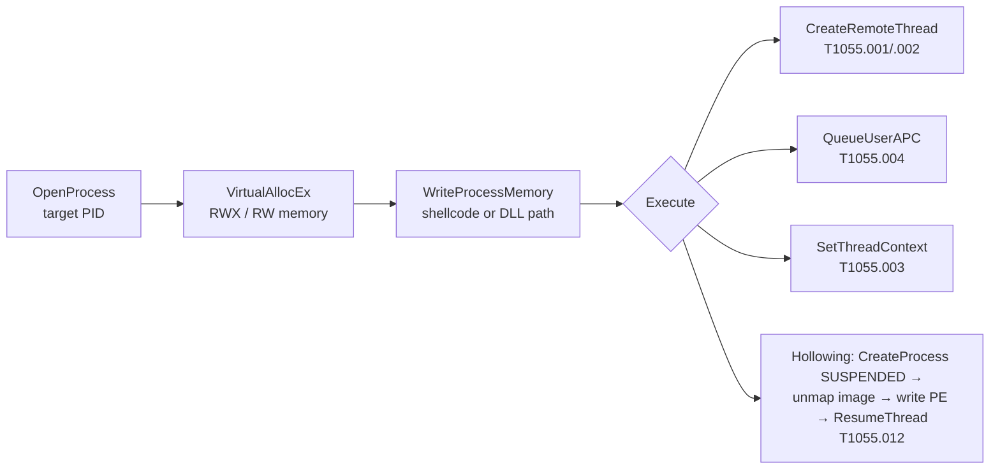

# Process Injection

<div class="dfir-meta" markdown>
**MITRE ATT&CK:** T1055 (Process Injection) — .001 DLL Injection · .002 PE Injection · .003 Thread Execution Hijacking · .004 APC · .012 Process Hollowing · **Tactic:** Defense Evasion / Privilege Escalation · **Last updated:** 2026-10-07
</div>

!!! abstract "Summary"
    Instead of running as `evil.exe`, malware writes its code into the memory of a legitimate process (`explorer.exe`, `svchost.exe`, `rundll32.exe`, a browser) and executes it there. The malicious activity then *looks* like it comes from a trusted, signed process, inherits that process's token and network permissions, and often never exists as a file on disk. Every C2 framework (Cobalt Strike, Sliver, Havoc, Brute Ratel) uses injection for post-exploitation jobs. For the memory-forensics side, see [Memory: processes & injection](../memory/processes-injection.md).

## How the attack works

The classic sequence is four Windows API calls:



| Variant | Key idea | Memory tell |
|---|---|---|
| DLL injection | Remote thread calls `LoadLibrary` on a DLL path | DLL loaded from an odd path (`%TEMP%`, `ProgramData`) |
| Reflective DLL / shellcode | DLL maps itself — never registered with the loader | **Private, executable memory not backed by a file** (`malfind` hit) |
| Process hollowing | Start a legit process suspended, replace its image | Image path on disk ≠ code in memory; `PEB` image base mismatch |
| APC / Early Bird | Queue code to a thread before it starts | Same as shellcode |
| Module stomping / threadless | Overwrite a legitimately loaded DLL's `.text` | File-backed but modified — harder; compare with disk |

## Attacker tooling / commands

```text
# C2 frameworks
Cobalt Strike:  inject <pid> x64 <listener> · spawnto · shinject · execute-assembly (fork & run)
Metasploit:     migrate <pid> · post/windows/manage/shellcode_inject
Sliver / Havoc / Brute Ratel: equivalent commands

# Common spawn-to sacrificial processes
rundll32.exe (no arguments!) · dllhost.exe · werfault.exe · gpupdate.exe · svchost.exe -k
```

!!! tip "The sacrificial process gives it away"
    Cobalt Strike's default `spawnto` is `rundll32.exe` **with no command-line arguments** — a real `rundll32` always has a DLL argument. A `rundll32.exe` with an empty command line making network connections is one of the highest-yield hunts in Windows.

## Affected Windows versions

Injection uses documented APIs and works on **every Windows version from XP to 11 / Server 2025**. What changed over time is the defender's visibility and the hardening available:

| Version | Relevant change |
|---|---|
| XP / 2003 | No ASLR/DEP by default for most apps (DEP from XP SP2, opt-in) — injection and exploitation trivial |
| **Vista / 2008** | ASLR, integrity levels — a Medium process cannot inject into a High/SYSTEM one |
| 8.1 / 2012 R2 | **Protected Process Light (PPL)** for AV and LSASS (with RunAsPPL) — cannot be injected into from normal admin |
| **10** | Control Flow Guard, **ETW Threat-Intelligence** provider (EDR sees `WriteProcessMemory`/`QueueUserAPC`), Exploit Protection (ACG, CIG), **HVCI** |
| 11 | HVCI / memory integrity on by default on new installs; Smart App Control; hardware-enforced stack protection |

## Artifacts left behind

| Where | Artifact | What to look for |
|---|---|---|
| Sysmon | **8** (CreateRemoteThread) — `SourceImage` ≠ `TargetImage`, `StartModule` empty or `StartFunction` = `LoadLibraryA/W` | Remote thread creation into another process |
| Sysmon | **10** (ProcessAccess) with `GrantedAccess` incl. `0x1F0FFF`, `0x1F3FFF`, `0x143A` (`VM_WRITE`+`VM_OPERATION`+`CREATE_THREAD`) and `CallTrace` containing `UNKNOWN(...)` | Handle opened for injection; `UNKNOWN` frames = calls from unbacked memory |
| Sysmon | **25** (ProcessTampering) — `Type: Image is replaced` | Process hollowing / herpaderping |
| Sysmon | **1** — `rundll32.exe`/`dllhost.exe`/`werfault.exe` with **no arguments**; **3** — those processes making outbound connections | Sacrificial spawn-to processes |
| Sysmon | **7** (ImageLoad) — unsigned DLL loaded from user-writable path into a signed process | DLL injection / side-loading |
| Memory | Volatility `windows.malfind` (PAGE_EXECUTE_READWRITE private regions with MZ / shellcode), `windows.hollowprocesses`, `ldrmodules` mismatches | Ground truth — see [Memory: processes & injection](../memory/processes-injection.md) |
| Network | [Beaconing](../network/beaconing-c2.md) from a process that never talks to the internet (`notepad.exe`, `rundll32.exe`) | Injected C2 |

## Detection

=== "Splunk — remote threads"

    ```spl
    index=botsv3 sourcetype="XmlWinEventLog:Microsoft-Windows-Sysmon/Operational" EventID=8
    | eval src=lower(replace(SourceImage,".*\\\\","")), tgt=lower(replace(TargetImage,".*\\\\",""))
    | search NOT src IN ("csrss.exe","wininit.exe","services.exe","msmpeng.exe","vmtoolsd.exe")
    | stats count, values(StartFunction) as func, values(StartModule) as mod by host, src, tgt
    | sort - count
    ```

    Sysmon `8` = a process created a thread in **another** process. Legitimate cases exist (AV, debuggers, `csrss`), so the `NOT ... IN (...)` list removes known-good sources — build that list from your own baseline. Office, browsers, `powershell.exe` or anything in `%TEMP%` creating remote threads is malicious until proven otherwise.

=== "Splunk — argument-less rundll32 talking out"

    ```spl
    index=botsv3 sourcetype="XmlWinEventLog:Microsoft-Windows-Sysmon/Operational" EventID=1 Image="*\\rundll32.exe"
    | where match(CommandLine,"(?i)rundll32(\.exe)?\"?\s*$")
    | table _time, host, User, ParentImage, CommandLine, ProcessGuid
    | join type=left ProcessGuid
        [ search index=botsv3 sourcetype="XmlWinEventLog:Microsoft-Windows-Sysmon/Operational" EventID=3
          | stats values(DestinationIp) as dst, values(DestinationPort) as dport by ProcessGuid ]
    ```

    The `where` keeps `rundll32` whose command line *ends* right after the executable name — no DLL argument. `ProcessGuid` is Sysmon's unique process ID; the `join` brings in any network connections (Sysmon `3`) made by that same process.

=== "Splunk — hollowing"

    ```spl
    index=botsv3 sourcetype="XmlWinEventLog:Microsoft-Windows-Sysmon/Operational" EventID=25
    | table _time, host, User, Image, Type
    ```

    Sysmon `25` (Sysmon 13+) = process image changed from what was mapped from disk.

## Response

Memory is the evidence. **Capture RAM before killing the process** (see [Imaging & collection](../tools/imaging-collection.md)), then analyse with Volatility. Identify the injecting process (Sysmon 8/10 `SourceImage`) — that is the real malware; the target is just a host. Block the C2 destinations seen from the injected process.

### Remediation by Windows version

| Control | What it stops | Available on |
|---|---|---|
| **EDR** using kernel callbacks + ETW-TI | Detects/blocks allocation-write-execute patterns | 7 → 11 (vendor-dependent; ETW-TI on 10+) |
| **ASR rules** — *Block Office applications from injecting code into other processes*, *Block credential stealing from LSASS* | Common injection launch points | 10 1709+, Server 2019+ (Defender AV) |
| **Exploit Protection** — ACG, CIG, *Block low-integrity images*, *Code integrity guard* per process | Unsigned code / dynamic code in protected processes | 10 1709+ |
| **HVCI / Memory integrity** | Kernel-mode injection, vulnerable-driver abuse | 10+; default on new 11 installs |
| **PPL** for AV and LSASS (`RunAsPPL`) | Injection into security processes | 8.1 / 2012 R2+ |
| WDAC | Unsigned injector binaries / DLLs | 10 / 2016+ |
| Sysmon with events 8, 10, 25 | Visibility | Event 25 needs Sysmon 13+ |
| Retire XP / 2003 / 7 | No modern mitigations available | — |

## References

- [MITRE ATT&CK — T1055](https://attack.mitre.org/techniques/T1055/)
- Pages: [Memory: processes & injection](../memory/processes-injection.md) · [Beaconing & C2](../network/beaconing-c2.md) · [LSASS dumping](lsass-dumping.md)
