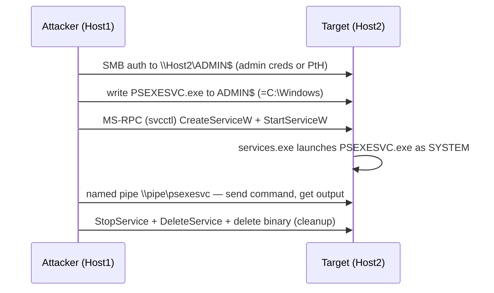

# PsExec & SMB Lateral Movement

<div class="dfir-meta" markdown>
**MITRE ATT&CK:** T1021.002 (SMB/Windows Admin Shares) + T1569.002 (Service Execution) · **Tactic:** Lateral Movement / Execution · **Last updated:** 2026-09-17
</div>

!!! abstract "Summary"
    With admin credentials (or a stolen hash), an attacker copies a service binary to the target's hidden **`ADMIN$`** share over SMB, then remotely creates and starts a **Windows service** that runs it — giving SYSTEM-level command execution on the remote host. Sysinternals PsExec is the original; Impacket `psexec.py`, Cobalt Strike `jump psexec`, and countless clones follow the same pattern.

## How the attack works



The three observable stages are **SMB write to an admin share**, **service creation**, and **service start** — plus a named pipe for I/O. Cleanup often deletes the binary and service, but the event-log records of the service install survive.

## Attacker tooling / commands

```text
# Sysinternals
PsExec.exe \\HOST2 -s -accepteula cmd.exe

# Impacket
psexec.py CORP/admin:pass@10.0.0.5           # drops RemComSvc-style service
smbexec.py CORP/admin@10.0.0.5 -hashes :<hash>   # semi-interactive, no binary drop
wmiexec.py ...                                    # WMI variant — see WMI/WinRM page

# Cobalt Strike
jump psexec HOST2 smb              # or psexec64 / psexec_psh (no binary on disk)
```

## Artifacts left behind

| Where | Artifact | What to look for |
|---|---|---|
| **Target** Security log | **4624 Logon Type 3** (network logon, admin account) | The inbound admin auth |
| Target Security log | **4672** (admin privileges) same Logon ID | Privileged session |
| Target Security log | **5140** (network share accessed) / **5145** (share object checked) for `ADMIN$`, `IPC$`, `C$` | The binary copy and pipe access; `Relative_Target_Name` like `PSEXESVC.exe` |
| Target System log | **7045** (service installed) — `Service_File_Name`, `Service_Name` | `PSEXESVC`, `RemComSvc`, or a random 8-char name; binary in `C:\Windows\` or a temp path |
| Target System log | **7036** (service state) / **7034** (crashed) | Start/stop of the service |
| Target Sysmon | **1** (`PSEXESVC.exe` child processes as SYSTEM), **11** (binary written), **17/18** (named pipe `\psexesvc`, `\RemCom_communicaton`) | Process + pipe evidence even after file deletion |
| Target host | [Prefetch](../windows/prefetch.md) `PSEXESVC.EXE-*.pf`; [$UsnJrnl/$MFT](../windows/mft-usn.md) shows create+delete of the binary | Survives cleanup |
| **Source** host | Security **4648** (explicit creds), [Prefetch](../windows/prefetch.md) `PSEXEC.EXE`, [ShellBags/LNK](../windows/lnk-jumplists.md) | Where the movement originated |
| Network | [Zeek `smb_files.log`](../network/zeek/index.md) — `WRITE` of `*.exe` to `ADMIN$`; [`dce_rpc.log`](../network/zeek/index.md) — `svcctl` operations; [`conn.log`](../network/zeek/conn-log.md) internal→internal `445` | The copy + service creation on the wire |

## Detection

=== "Splunk — the full chain on the target"

    ```spl
    index=botsv3 (sourcetype=WinEventLog EventCode IN (4624,5140,5145)) OR (sourcetype="WinEventLog:System" EventCode=7045)
    | eval share=coalesce(Share_Name, Relative_Target_Name)
    | where EventCode!=4624 OR Logon_Type=3
    | eval src=coalesce(Source_Network_Address, Source_Address)
    | stats values(EventCode) as codes, values(share) as shares, values(Service_File_Name) as svc_bin, min(_time) as first, max(_time) as last by host, src
    | where match(mvjoin(codes,","),"514[05]") AND match(mvjoin(codes,","),"7045")
    | convert ctime(first) ctime(last)
    | sort first
    ```

    This gathers logon (`4624/3`), share access (`5140`/`5145`), and service install (`7045`) per target host + source IP, then keeps only groups that contain **both** a share-access code and a service install — the defining PsExec signature. `values(Service_File_Name)` shows the dropped binary path; `mvjoin` flattens the multivalue code list so `match` can test it.

=== "Splunk — suspicious 7045 alone"

    ```spl
    index=botsv3 sourcetype="WinEventLog:System" EventCode=7045
    | eval bin=lower(Service_File_Name)
    | where match(bin,"psexesvc|remcom|paexec|\\\\windows\\\\[a-z0-9]{8}\\.exe|-enc |powershell|%comspec%|\\\\temp\\\\|\\\\users\\\\public")
    | table _time, host, Service_Name, Service_File_Name, Account_Name
    | sort 0 _time
    ```

    `7045` = a service was installed. The regex flags known PsExec service names, random 8-character binaries in `C:\Windows`, and services whose binary is an encoded PowerShell one-liner or lives in a user/temp path — all abnormal for a legitimate service.

=== "Zeek — SMB write + RPC service control"

    ```bash
    # Executable written to an admin share
    zeek-cut -d ts id.orig_h id.resp_h path name action size < smb_files.log \
      | grep -iE 'ADMIN\$|C\$' | grep -iE '\.(exe|dll)\b'

    # Service-control RPC operations (svcctl) between internal hosts
    zeek-cut -d ts id.orig_h id.resp_h operation < dce_rpc.log | grep -iE 'svcctl|CreateService|StartService'
    ```

    `smb_files.log` shows the binary being written to `ADMIN$`/`C$`; `dce_rpc.log` shows the `svcctl` `CreateServiceW`/`StartServiceW` calls that follow. Together they are PsExec on the network, and the `uid` pivots into [`conn.log`](../network/zeek/conn-log.md) for timing.

## Response

Isolate both hosts (source and target), and treat the admin credential used as compromised — rotate it and hunt everywhere it authenticated (the `5140`/`4648` trail). The service install and named-pipe artifacts survive attacker cleanup, so reconstruct the chain from `7045` + Sysmon 17/18 + [$UsnJrnl](../windows/mft-usn.md) even if the binary is gone. Preserve [Prefetch](../windows/prefetch.md) on both ends. Harden: restrict who can authenticate to `ADMIN$`/`C$` (they can't be removed, but SMB access can be limited by firewall and tiering), enforce LAPS so a single local-admin hash doesn't open every host, deploy Sysmon with service-creation and named-pipe rules, and alert on `7045` for non-standard binaries continuously.

## References

- [MITRE ATT&CK — T1021.002](https://attack.mitre.org/techniques/T1021/002/) · [T1569.002](https://attack.mitre.org/techniques/T1569/002/)
- [JPCERT — Detecting lateral movement (tool analysis)](https://jpcertcc.github.io/ToolAnalysisResultSheet/)
- Pages: [Pass-the-Hash](pass-the-hash.md) · [WMI & WinRM](wmi-winrm.md) · [MFT/USN](../windows/mft-usn.md) · [Zeek SMB](../network/zeek/index.md) · [Security searches](../splunk/security-searches.md)
