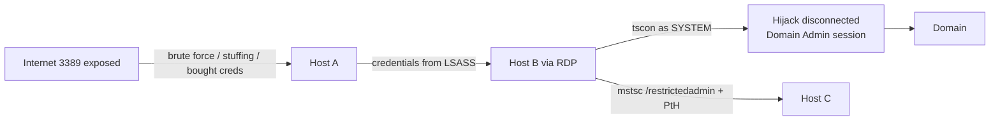

# RDP — Remote Desktop Abuse

<div class="dfir-meta" markdown>
**MITRE ATT&CK:** T1021.001 (Remote Services: Remote Desktop Protocol) · T1133 (External Remote Services) · T1110 (Brute Force) · T1563.002 (RDP Hijacking) · **Tactic:** Initial Access / Lateral Movement · **Last updated:** 2026-10-07
</div>

!!! abstract "Summary"
    RDP gives a full interactive desktop. Internet-exposed RDP is one of the top **initial access** routes for ransomware (brute-forced or bought credentials), and inside the network it is the operator's favourite **lateral movement** once they have a password — it looks like normal admin work. Two extra tricks: **RDP session hijacking** (`tscon` as SYSTEM takes over a disconnected admin's session with no password) and **Restricted Admin pass-the-hash** (RDP with only an NT hash).

## How the attack works



## Attacker tooling / commands

```text
# Brute force / spray (external)
hydra -L users.txt -P pass.txt rdp://target · crowbar · ncrack · nxc rdp

# Lateral
mstsc /v:host  ·  xfreerdp /u:admin /d:CORP /pth:<NThash> /v:host   (Restricted Admin PtH)

# Session hijack (needs SYSTEM on the host)
query user
sc create hj binpath= "cmd /k tscon 2 /dest:rdp-tcp#5"  &  sc start hj

# Enable RDP on a host remotely
reg add "HKLM\System\CurrentControlSet\Control\Terminal Server" /v fDenyTSConnections /t REG_DWORD /d 0 /f
netsh advfirewall firewall set rule group="remote desktop" new enable=Yes

# Tunnelling RDP through C2 (no 3389 on the wire)
ngrok / chisel / plink -R 3389
```

## Affected Windows versions

| Version | Exposure | Version-specific |
|---|---|---|
| **XP / 2003** | No NLA on the server side; credentials sent after the session is set up | **BlueKeep (CVE-2019-0708)** — pre-auth wormable RCE; MS issued out-of-band XP/2003 patches |
| **Vista / 2008** | NLA available (CredSSP) | BlueKeep affects these too |
| **7 / 2008 R2** | NLA on by default for new configs | **BlueKeep** (7 / 2008 R2 last affected); **DejaBlue** (CVE-2019-1181/1182) |
| **8.1 / 2012 R2** | Restricted Admin mode introduced (also back-ported to 7 / 2008 R2) — no creds left on target, but enables **PtH over RDP** | DejaBlue affected 8.1 / 10 / 2012 R2 – 2019 |
| **10 / 2016+** | Remote Credential Guard (1607+); session hijack via `tscon` as SYSTEM still works | |
| **11 / 2022 / 2025** | Account lockout policy default (10 attempts / 10 min) on new 11 22H2+ installs | Credential reuse & brute force are still the main threat |

## Artifacts left behind

| Where | Artifact | What to look for |
|---|---|---|
| **Target** Security log | **4624 Logon Type 10** (RemoteInteractive) — `Source_Network_Address` = client; Type **7** on reconnect; **4625** failures (Type 10 or 3 with NLA) | Who logged on from where. NLA brute force often shows as **4625 Type 3** |
| Target | **4778** (session reconnected) / **4779** (session disconnected) — with client name & IP | Session hijack shows 4778 *without* a fresh 4624 for that user |
| Target | `TerminalServices-RemoteConnectionManager/Operational` **1149** — "User authentication succeeded" (user, domain, source IP) | Network-level connection, logged even before full logon |
| Target | `TerminalServices-LocalSessionManager/Operational` **21** (logon), **22** (shell start), **24** (disconnect), **25** (reconnect), **39/40** | Full session timeline; **25** with a different source = possible hijack |
| Target | `RdpCoreTS` **131** (connection accepted, source IP:port) | Captures the client even for failed attempts |
| **Source** host | `TerminalServices-RDPClient/Operational` **1024 / 1102** (destination hostname / IP) | Where the attacker went *from* this host |
| Source host registry | `NTUSER\Software\Microsoft\Terminal Server Client\Servers\<host>` (UsernameHint) and `Default` MRU | Lateral movement destinations, per user — see [Registry keys](../windows/registry-keys.md) |
| Source host files | `%LOCALAPPDATA%\Microsoft\Terminal Server Client\Cache\bcache*.bmc` / `Cache*.bin` | **Bitmap cache** — tiles of what the attacker saw on the remote screen (parse with `bmc-tools`) |
| Restricted Admin | 4624 Type 10 with **`Restricted_Admin_Mode = Yes`** | PtH-over-RDP candidate |
| Network | [Zeek `rdp.log`](../network/zeek/index.md) — `cookie` (username), `client_name`, `security_protocol`; `conn.log` 3389 from the internet | Usernames and brute-force volume on the wire |

## Detection

=== "Splunk — external RDP logons"

    ```spl
    index=botsv3 sourcetype=WinEventLog EventCode=4624 Logon_Type IN (10,7)
    | where NOT cidrmatch("10.0.0.0/8",Source_Network_Address) AND NOT cidrmatch("172.16.0.0/12",Source_Network_Address) AND NOT cidrmatch("192.168.0.0/16",Source_Network_Address)
    | iplocation Source_Network_Address
    | table _time, host, Account_Name, Source_Network_Address, Country, City
    ```

    `Logon_Type 10` = RemoteInteractive (RDP); `7` = unlock/reconnect. `cidrmatch()` tests whether an IP is in a range — the three `NOT` filters remove RFC1918 private addresses so only public sources remain. `iplocation` adds geolocation fields.

=== "Splunk — brute force / spray"

    ```spl
    index=botsv3 sourcetype=WinEventLog EventCode=4625 Logon_Type IN (3,10)
    | bin _time span=15m
    | stats count as fails, dc(Account_Name) as users by _time, host, Source_Network_Address
    | where fails > 20 OR users > 10
    ```

    `4625` = failed logon. Many failures for one user = brute force; few failures across many users = password spraying. Then look for a **4624 from the same source** afterwards — that is the success.

=== "Splunk — session hijack"

    ```spl
    index=botsv3 (sourcetype="XmlWinEventLog:Microsoft-Windows-Sysmon/Operational" EventID=1) OR (sourcetype=WinEventLog EventCode=4688)
    | eval cmd=lower(coalesce(CommandLine, Process_Command_Line))
    | where match(cmd,"tscon(\.exe)?\s+\d+\s+/dest:")
    | table _time, host, User, ParentImage, cmd
    ```

    `tscon <id> /dest:<session>` connects one session to another. Run as `SYSTEM` (often from a service created just for it — check 7045 at the same time), it needs no password.

## Response

Disable/reset the accounts used, block the source IPs, and close external exposure immediately. On every host the attacker RDP'd into, check the **source** artifacts (RDPClient log, Terminal Server Client registry, bitmap cache) to follow the chain onward. Use the bitmap cache to see what the attacker looked at.

### Remediation by Windows version

| Control | What it stops | Available on |
|---|---|---|
| **No RDP on the internet** — VPN / RD Gateway with **MFA** | External brute force, BlueKeep exposure | All |
| Patch **BlueKeep** / DejaBlue | Pre-auth RCE | XP / 2003 (out-of-band), Vista, 7, 2008 / R2 (BlueKeep); 8.1 – 2019 (DejaBlue) |
| **Network Level Authentication** required | Pre-auth exposure, resource exhaustion; mitigates BlueKeep | Server Vista / 2008+; XP SP3 client supports NLA |
| Account lockout policy | Brute force | All; default on 11 22H2+ new installs |
| **Remote Credential Guard** (`mstsc /remoteGuard`) | Credential theft on the RDP target | 10 1607+ / 2016+ (both ends) |
| Restricted Admin — use deliberately; **disable** (`DisableRestrictedAdmin=1`) where not used | PtH over RDP | 8.1 / 2012 R2+ (back-ported to 7 / 2008 R2) |
| Limit *Allow log on through Remote Desktop Services* to admin groups; deny for local accounts | Lateral RDP with harvested users | All |
| Session timeouts: log off disconnected sessions (*Set time limit for disconnected sessions*) | Session hijacking of idle admin sessions | All |
| Host firewall: allow 3389 only from jump hosts / PAWs | Lateral RDP | Vista / 2008+ (WFAS) |

## References

- [MITRE ATT&CK — T1021.001](https://attack.mitre.org/techniques/T1021/001/) · [T1563.002](https://attack.mitre.org/techniques/T1563/002/)
- [Microsoft — CVE-2019-0708 (BlueKeep)](https://msrc.microsoft.com/update-guide/vulnerability/CVE-2019-0708)
- Pages: [Event logs](../windows/event-logs.md) · [Registry keys](../windows/registry-keys.md) · [Lateral movement playbook](../playbooks/lateral-domain.md)
