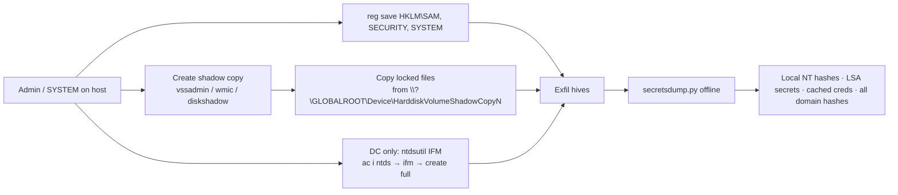

# SAM, LSA Secrets & NTDS.dit Extraction

<div class="dfir-meta" markdown>
**MITRE ATT&CK:** T1003.002 (Security Account Manager) · T1003.004 (LSA Secrets) · T1003.003 (NTDS) · **Tactic:** Credential Access · **Last updated:** 2026-10-07
</div>

!!! abstract "Summary"
    [LSASS dumping](lsass-dumping.md) steals what is *in memory*. This page is the *on-disk* half: the **SAM** hive (local account NT hashes), the **SECURITY** hive (LSA Secrets — service account passwords, cached domain logons, the machine account secret) and, on a domain controller, **`NTDS.dit`** (every domain account's hash, including `krbtgt`). All of them are encrypted with a key derived from the **SYSTEM** hive, so attackers always grab SYSTEM too. Because these files are locked while Windows runs, the attacker copies them through the registry API, a **Volume Shadow Copy**, or `ntdsutil` "Install From Media".

## How the attack works



The key point for responders: **once the files leave the host, the cracking and parsing happen offline**. Everything detectable happens in the short copy window on the host.

## Attacker tooling / commands

```text
# Registry API — no shadow copy needed (local hives)
reg save HKLM\SAM     C:\Windows\Temp\sam.save
reg save HKLM\SYSTEM  C:\Windows\Temp\system.save
reg save HKLM\SECURITY C:\Windows\Temp\security.save

# Shadow copy route (for NTDS.dit or locked files)
vssadmin create shadow /for=C:
copy \\?\GLOBALROOT\Device\HarddiskVolumeShadowCopy1\Windows\NTDS\ntds.dit C:\Temp\
esentutl.exe /y /vss C:\Windows\NTDS\ntds.dit /d C:\Temp\ntds.dit

# DC: Install From Media (legitimate admin feature, abused)
ntdsutil "ac i ntds" "ifm" "create full C:\Temp\ifm" q q

# In-memory / remote equivalents
mimikatz  lsadump::sam  /  lsadump::secrets  /  lsadump::cache
secretsdump.py  CORP/admin@10.0.0.5          # remote: uses RemoteRegistry + temp files
secretsdump.py -sam sam.save -system system.save -security security.save LOCAL
```

## Affected Windows versions

| Version | Exposure | Version-specific notes |
|---|---|---|
| **XP / Server 2003** | Vulnerable | Stores **LM hashes** by default (`NoLMHash` off) — LM is cracked in seconds. SYSKEY only obscures, does not protect |
| **Vista / 2008** | Vulnerable | `NoLMHash=1` by default from here on — only NT hashes stored |
| **7 / 2008 R2 · 8.1 / 2012 R2** | Vulnerable | Same technique; cached domain logons (`CachedLogonsCount`, default 10) in SECURITY hive |
| **10 / 2016 / 2019** | Vulnerable | **HiveNightmare / SeriousSAM (CVE-2021-36934)**: on 10 **1809 → 21H1**, `C:\Windows\System32\config\*` had over-permissive ACLs, so a **non-admin** could read SAM from any existing shadow copy |
| **11 / 2022 / 2025** | Vulnerable | Early Windows 11 builds were also affected by CVE-2021-36934 until patched. Credential Guard does **not** protect SAM or NTDS.dit |

!!! warning "HiveNightmare is the version trap"
    The July/August 2021 patch fixed the ACL on `config\` but **did not fix shadow copies that already existed** — those still held the readable copy. Microsoft's remediation required running `icacls %windir%\system32\config\*.* /inheritance:e` **and deleting existing shadow copies**, then creating a new restore point. Any Windows 10 host built 1809–21H1 that was only patched may still be exposed.

## Artifacts left behind

| Where | Artifact | What to look for |
|---|---|---|
| Security log | **4688** command line: `reg save hklm\sam`, `vssadmin create shadow`, `ntdsutil ... ifm`, `esentutl /y /vss`, `wmic shadowcopy call create` | The copy method. 4688 = a new process was created (needs command-line auditing enabled) |
| Sysmon | **1** (process create) same strings; **11** (file create) of `*.save`, `ntds.dit`, `SYSTEM`, `SAM` outside `System32\config` | Staged hive files in `Temp`, `ProgramData`, `PerfLogs` |
| Application log (DC) | **ESENT 216, 325, 326, 327** around the same time as `ntdsutil` | `ntdsutil` IFM and `esentutl` copies open/attach a new database copy — ESENT logs that |
| System log | **7036** "Volume Shadow Copy service entered the running state" on a host that does not normally run backups | Shadow copy creation outside the backup window |
| Security log | **4656 / 4663** object access on `\REGISTRY\MACHINE\SAM` or `SECURITY` (requires a SACL) | Direct hive access |
| Remote (secretsdump) | **7045/7036** RemoteRegistry started; **5145** access to `\\host\ADMIN$` and `IPC$` → `winreg` pipe | Remote dumping leaves service and named-pipe traces on the target |
| File system | [$MFT / $UsnJrnl](../windows/mft-usn.md) create + delete of `*.save` / `ntds.dit` copies; [Prefetch](../windows/prefetch.md) for `ntdsutil.exe`, `vssadmin.exe`, `esentutl.exe` | Survives the attacker deleting the staged files |
| Network | [Zeek `smb_files.log`/`files.log`](../network/zeek/files-log.md) — large file named `ntds.dit` or hive names leaving the DC | The exfil |

## Detection

=== "Splunk — copy commands"

    ```spl
    index=botsv3 (sourcetype="XmlWinEventLog:Microsoft-Windows-Sysmon/Operational" EventID=1) OR (sourcetype=WinEventLog EventCode=4688)
    | eval cmd=lower(coalesce(CommandLine, Process_Command_Line))
    | where match(cmd,"reg(\.exe)?\s+save\s+hklm\\\\(sam|system|security)|vssadmin.*create\s+shadow|shadowcopy\s+call\s+create|ntdsutil.*ifm|esentutl.*/vss|diskshadow")
    | table _time, host, User, cmd
    | sort 0 _time
    ```

    `coalesce()` takes whichever command-line field exists (Sysmon `CommandLine` or Security-log `Process_Command_Line`). `match()` is a regular-expression test. The pattern covers the four copy routes: `reg save` of a sensitive hive, a shadow copy being created, `ntdsutil` IFM, and `esentutl` copying through VSS. Any hit on a workstation or DC outside a documented backup job is high-fidelity.

=== "Splunk — staged hive files"

    ```spl
    index=botsv3 sourcetype="XmlWinEventLog:Microsoft-Windows-Sysmon/Operational" EventID=11
    | where match(TargetFilename,"(?i)(ntds\.dit|\\\\(sam|system|security)(\.save|\.hiv|\.bak)?$)")
    | where NOT match(TargetFilename,"(?i)\\\\windows\\\\system32\\\\config\\\\")
    | table _time, host, Image, User, TargetFilename
    ```

    Sysmon `11` = file created. The second `where` drops the real hive location so only *copies* remain.

=== "Splunk — ESENT on DCs"

    ```spl
    index=botsv3 sourcetype=WinEventLog:Application SourceName=ESENT EventCode IN (216,325,326,327)
    | stats values(EventCode) as codes, values(Message) as msg by host, _time
    ```

    `IN (...)` matches any of a list. ESENT 325 = new database created, 326 = database attached, 327 = database detached, 216 = database location changed. On a DC, this cluster near an `ntdsutil` execution is NTDS theft.

## Response

Treat a stolen `NTDS.dit` as **full domain compromise**: every password hash, including `krbtgt` and all service accounts, is now offline. Rotate `krbtgt` **twice** (see [Golden & Silver tickets](golden-silver-tickets.md)), reset privileged and service account passwords, and plan a domain-wide password reset. For a workstation SAM, the immediate risk is local-admin hash reuse ([Pass-the-Hash](pass-the-hash.md)) — check whether that local admin password is shared across hosts.

### Remediation by Windows version

| Control | What it stops | Available on |
|---|---|---|
| Disable LM hash storage (`NoLMHash=1`) and force a password change | Trivially crackable LM hashes | Default **Vista / 2008+**; must be set by GPO on **XP / 2003** (existing LM hashes only disappear after the next password change) |
| **LAPS** — unique random local admin password per host | Reuse of a stolen SAM hash across the fleet | **Windows LAPS** built in: 10 20H2+, 11, Server 2019 / 2022 / 2025 (April 2023 update). **Legacy LAPS** (MSI) for older supported OSes |
| Patch CVE-2021-36934 **and** delete old shadow copies | Non-admin SAM read (HiveNightmare) | 10 1809 → 21H1, early 11 |
| Lower `CachedLogonsCount` (0–2 on servers) | Cached domain credential theft from SECURITY hive | All versions |
| **BitLocker** | Offline theft of hives / `ntds.dit` from a stolen disk or VM image | Vista Enterprise/Ultimate, 7 Enterprise/Ultimate, 8+ Pro/Enterprise, Server 2008+ |
| Tier 0 isolation of DCs, backups and hypervisors | Access to `ntds.dit`, DC backups and DC VM disks | Process control — all versions |
| Remove admin rights; monitor 4688 + Sysmon 1 for the commands above | Everything on this page requires admin first | All versions (command-line in 4688 from **8.1 / 2012 R2**, backported to 7 / 2008 R2 via KB3004375) |

## References

- [MITRE ATT&CK — T1003.002](https://attack.mitre.org/techniques/T1003/002/) · [T1003.003](https://attack.mitre.org/techniques/T1003/003/) · [T1003.004](https://attack.mitre.org/techniques/T1003/004/)
- [Microsoft — CVE-2021-36934 guidance](https://msrc.microsoft.com/update-guide/vulnerability/CVE-2021-36934)
- Pages: [LSASS dumping](lsass-dumping.md) · [DCSync](dcsync.md) · [Hardening by version](hardening-by-version.md) · [Memory: credentials & registry](../memory/credentials-registry.md)
