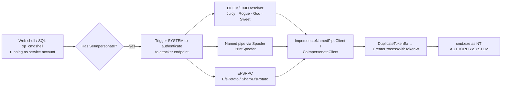

# Token Impersonation & Potato Attacks

<div class="dfir-meta" markdown>
**MITRE ATT&CK:** T1134.001 (Token Impersonation/Theft) · T1134.002 (Create Process with Token) · **Tactic:** Privilege Escalation / Defense Evasion · **Last updated:** 2026-10-07
</div>

!!! abstract "Summary"
    Every Windows process runs with an **access token**. A process holding **`SeImpersonatePrivilege`** (or `SeAssignPrimaryTokenPrivilege`) can take on the identity of any client that connects to it. Service accounts — IIS app pools, MSSQL, `LOCAL SERVICE`, `NETWORK SERVICE` — hold these privileges by design. The "**Potato**" family of exploits tricks a **SYSTEM** process into connecting to an attacker-controlled endpoint (COM/DCOM, named pipe, RPC), so the attacker can impersonate that SYSTEM token. That is why "I got a web shell as `IIS APPPOOL\DefaultAppPool`" almost always becomes "I am SYSTEM" a minute later.

## How the attack works



Classic **token theft** (Mimikatz `token::elevate`, Meterpreter `incognito`) is the same idea from an admin context: open a process owned by another user (e.g. a Domain Admin's `explorer.exe`) and duplicate its token.

## Attacker tooling / commands

```text
whoami /priv                 # look for SeImpersonatePrivilege  Enabled

PrintSpoofer64.exe -i -c cmd                 # 10 / 2016 / 2019, needs Spooler
JuicyPotato.exe -l 1337 -p cmd.exe -t * -c {CLSID}    # ≤ 10 1803 / 2016
GodPotato -cmd "cmd /c whoami"               # 2012 → 2022, 8 → 11
SweetPotato.exe / RoguePotato.exe / EfsPotato.exe

mimikatz  token::elevate /domainadmin
incognito list_tokens -u ; impersonate_token "CORP\\da_user"
```

## Affected Windows versions

| Variant | Works on | Notes |
|---|---|---|
| Hot / Rotten Potato | 7, 8, 10 (early), 2008 R2 – 2016 | NTLM reflection via local WPAD/DCOM — largely patched |
| **JuicyPotato** | 7 → 10 **1803**, 2008 R2 → 2016 | DCOM changes in **10 1809 / Server 2019** broke it |
| **RoguePotato** | 10 1809+, 2019 | Needs a remote OXID resolver redirect (TCP 135 egress) |
| **PrintSpoofer** | 8.1 → 11, 2012 R2 → 2022 | Needs **Print Spooler** running |
| **GodPotato** | 8 → 11, 2012 → 2022 | Abuses DCOM RPCSS; widely used today |
| Token theft (incognito / mimikatz) | XP → 11, all Server | Needs admin/SYSTEM already; target user must be logged on |
| **XP / 2003** | Service accounts often ran as **SYSTEM** directly | Network Service/Local Service existed, but many apps ran as LocalSystem — no Potato needed |

The underlying privilege model is unchanged in Windows 11 / Server 2025 — new variants appear as old triggers are closed.

## Artifacts left behind

| Where | Artifact | What to look for |
|---|---|---|
| Sysmon 1 / 4688 | `ParentImage` = `w3wp.exe`, `sqlservr.exe`, `httpd.exe`, `tomcat*.exe`, `php-cgi.exe` → child `cmd.exe` / `powershell.exe` with `User=NT AUTHORITY\SYSTEM` | The jump from service account to SYSTEM under a service parent |
| Sysmon | **17/18** (pipe created/connected) with names like `\pipe\*\pipe\spoolss` or random GUID pipes | PrintSpoofer and pipe-based variants |
| Security log | **4672** (special privileges assigned to new logon) for SYSTEM sessions tied to a web/SQL process chain | Privileged token use |
| Security log | **4624 Type 3** to `127.0.0.1` / `::1` as `SYSTEM` or machine account, followed by process creation | Local NTLM reflection (older Potatoes) |
| File system | Tool on disk in IIS webroot, `C:\ProgramData`, `C:\Users\Public`; [Prefetch](../windows/prefetch.md) / [Amcache](../windows/amcache.md) | Potato binaries are small and often renamed |
| IIS logs | Web shell request immediately before | The initial foothold — see [Web shell playbook](../playbooks/webshell-server.md) |

## Detection

=== "Splunk — service parent spawns SYSTEM shell"

    ```spl
    index=botsv3 sourcetype="XmlWinEventLog:Microsoft-Windows-Sysmon/Operational" EventID=1
    | eval parent=lower(replace(ParentImage,".*\\\\","")), child=lower(replace(Image,".*\\\\",""))
    | where parent IN ("w3wp.exe","sqlservr.exe","httpd.exe","php-cgi.exe","java.exe","tomcat9.exe")
       AND child IN ("cmd.exe","powershell.exe","pwsh.exe","whoami.exe","net.exe","rundll32.exe")
    | table _time, host, User, parent, child, CommandLine, ParentUser
    ```

    Any shell under a web or database server process is already worth investigating. The decisive hint is `User` = `NT AUTHORITY\SYSTEM` while `ParentUser` is the app-pool or SQL service identity — a privilege jump that should not happen.

=== "Splunk — suspicious named pipes"

    ```spl
    index=botsv3 sourcetype="XmlWinEventLog:Microsoft-Windows-Sysmon/Operational" EventID IN (17,18)
    | where match(PipeName,"(?i)\\\\pipe\\\\.+\\\\pipe\\\\|\\\\[0-9a-f]{8}-[0-9a-f]{4}-")
    | stats count by host, Image, PipeName
    ```

    Sysmon `17` = named pipe created, `18` = pipe connected. A pipe path containing a second `\pipe\` is the PrintSpoofer trick; GUID-named pipes created by non-Microsoft binaries are common to several Potato tools.

=== "Hunting — who has the privilege"

    ```powershell
    # On a server: which services run as accounts with SeImpersonate?
    Get-CimInstance Win32_Service | Select Name, StartName, State | Sort StartName
    secedit /export /cfg C:\Temp\secpol.inf ; Select-String "SeImpersonatePrivilege" C:\Temp\secpol.inf
    ```

## Response

Treat the server as SYSTEM-compromised: from SYSTEM the attacker can dump LSASS and the machine account. Find and remove the foothold (web shell, SQL injection) — fixing the Potato without fixing the foothold just means the next variant gets used.

### Remediation by Windows version

| Control | What it stops | Available on |
|---|---|---|
| Patch and harden the **foothold** (web app, SQL `xp_cmdshell` disabled) | Getting a service-account shell in the first place | All |
| Run services as **virtual accounts / gMSA** with least privilege; don't grant `SeImpersonate` to custom service accounts | Limits which processes hold the privilege | Virtual accounts 7 / 2008 R2+; gMSA 2012+ |
| **Disable Print Spooler** on servers that don't print | PrintSpoofer trigger | All versions |
| Keep OS patched (DCOM hardening, e.g. KB5004442 DCOM authentication hardening) | Closes older triggers | Supported versions only |
| ASR rule *Block process creations originating from PSExec and WMI commands* / EDR web-shell protections | Shell spawning under server processes | 10 1709+ / Server 2019+ (Defender) |
| WDAC on servers | Unsigned Potato binaries won't run | 10 / 2016+ |

## References

- [MITRE ATT&CK — T1134](https://attack.mitre.org/techniques/T1134/)
- [itm4n — PrintSpoofer: abusing impersonation privileges](https://itm4n.github.io/printspoofer-abusing-impersonate-privileges/)
- Pages: [UAC bypass](uac-bypass.md) · [Web shell playbook](../playbooks/webshell-server.md) · [PrintNightmare & Spooler](printnightmare.md)
