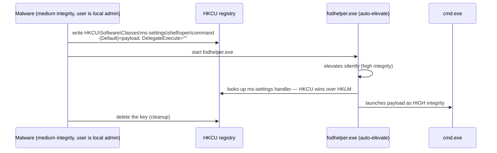

# UAC Bypass

<div class="dfir-meta" markdown>
**MITRE ATT&CK:** T1548.002 (Abuse Elevation Control Mechanism: Bypass User Account Control) · **Tactic:** Privilege Escalation / Defense Evasion · **Last updated:** 2026-10-07
</div>

!!! abstract "Summary"
    When a member of the local Administrators group logs on (Vista and later), Windows gives them a **filtered, medium-integrity token**; running something "as administrator" needs a UAC prompt to switch to the **high-integrity** token. Some signed Windows binaries are marked **auto-elevate** — they get the high token with no prompt at the default UAC level. A UAC bypass makes one of those auto-elevating binaries run the attacker's command, usually by planting a value in a **per-user (HKCU) registry key** the binary reads. Result: admin-level code from a non-prompting, already-admin user. Microsoft does **not** treat UAC as a security boundary, so many bypasses stay unpatched for years.

## How the attack works



Common families: **registry handler hijack** (fodhelper, computerdefaults, eventvwr via `mscfile`, sdclt), **environment variable / path hijack** (`%windir%` redirection for scheduled tasks like SilentCleanup), **DLL hijack** of auto-elevated binaries, and **elevated COM interfaces** (ICMLuaUtil). The open-source **UACME** project catalogues 70+ methods and the Windows builds each works on.

## Attacker tooling / commands

```text
# fodhelper (Windows 10/11) — what the registry write looks like
reg add HKCU\Software\Classes\ms-settings\shell\open\command /d "C:\Users\Public\p.exe" /f
reg add HKCU\Software\Classes\ms-settings\shell\open\command /v DelegateExecute /f
fodhelper.exe

# eventvwr (Windows 7 – early 10)
reg add HKCU\Software\Classes\mscfile\shell\open\command /d "cmd.exe" /f
eventvwr.exe

# Frameworks
UACME (Akagi64.exe <method#>) · Metasploit bypassuac_* · Cobalt Strike elevate uac-token-duplication
```

## Affected Windows versions

| Version | UAC? | Notes |
|---|---|---|
| **XP / 2003** | **No UAC** | Users typically ran as full admin — no bypass needed; privilege escalation used kernel/service exploits instead |
| **Vista / 2008** | Yes — but prompts for everything, few auto-elevate binaries | Bypass less common |
| **7 / 2008 R2** | Yes — introduced auto-elevation and the slider (default "Notify only when apps try to make changes") | eventvwr, sdclt, DLL-hijack bypasses widely used |
| **8.1 / 10** | Yes | fodhelper (10+), computerdefaults, SilentCleanup env-var hijack; eventvwr fixed in 10 1703 |
| **11** | Yes | Most registry-hijack methods still work at the default level. **Administrator protection** (just-in-time admin token behind Windows Hello, rolling out in recent 11 builds) breaks the auto-elevate model where enabled |
| **Server** | Yes, but the built-in Administrator (RID 500) is exempt by default (`FilterAdministratorToken=0`) | On servers, attackers often already have a full token |

## Artifacts left behind

| Where | Artifact | What to look for |
|---|---|---|
| Sysmon | **12/13** (registry key create / value set) under `HKCU\Software\Classes\<ms-settings, mscfile, exefile, Folder>\shell\open\command` or `HKCU\Environment\windir` | The hijack itself — almost never legitimate |
| Sysmon / 4688 | **1** — `ParentImage` is `fodhelper.exe`, `computerdefaults.exe`, `eventvwr.exe`, `sdclt.exe`, `wsreset.exe`, `slui.exe`, `changepk.exe` and child is a shell/LOLBin/unsigned exe | The payload starting under an auto-elevated parent |
| Sysmon 1 / 4688 | `IntegrityLevel=High` for a process whose parent chain started at Medium without a `consent.exe` in between | Elevation without a prompt |
| Registry (offline) | [NTUSER.DAT](../windows/registry-keys.md) `Software\Classes\...\shell\open\command` — key **LastWrite time** even if the value was deleted | Timeline evidence |
| Security log | **4688** `Token_Elevation_Type` = `%%1937` (TokenElevationTypeFull) for the payload | Type 2 = full token |

## Detection

=== "Splunk — registry hijack"

    ```spl
    index=botsv3 sourcetype="XmlWinEventLog:Microsoft-Windows-Sysmon/Operational" EventID IN (12,13)
    | where match(TargetObject,"(?i)\\\\Software\\\\Classes\\\\(ms-settings|mscfile|exefile|folder|launcher\.systemsettings)\\\\shell\\\\open\\\\command|\\\\Environment\\\\windir")
    | table _time, host, User, Image, EventType, TargetObject, Details
    ```

    Sysmon `12` = registry key created/deleted; `13` = registry value set. `TargetObject` is the full key path, `Details` the value written. The regex covers the handler keys used by the common bypasses plus the `windir` environment hijack.

=== "Splunk — auto-elevate parent → shell"

    ```spl
    index=botsv3 sourcetype="XmlWinEventLog:Microsoft-Windows-Sysmon/Operational" EventID=1
    | eval parent=lower(replace(ParentImage,".*\\\\",""))
    | where parent IN ("fodhelper.exe","computerdefaults.exe","eventvwr.exe","sdclt.exe","wsreset.exe","slui.exe","changepk.exe")
    | where NOT like(lower(Image),"%\\mmc.exe")
    | table _time, host, User, parent, Image, CommandLine, IntegrityLevel
    ```

    `replace(ParentImage,".*\\\\","")` strips the folder, leaving the file name. `eventvwr.exe` normally starts `mmc.exe`, so that is excluded; anything else spawned by these binaries is suspicious.

## Response

A UAC bypass means the user account is already a local admin and the attacker now has high integrity — scope the host as fully compromised (credential dumping usually follows). Remove the registry key, collect the payload, and check whether the same user is admin on other machines.

### Remediation by Windows version

| Control | What it stops | Available on |
|---|---|---|
| Users are **not local admins**; separate admin accounts | Removes the precondition for every UAC bypass | All versions (XP: the only real control) |
| UAC level **Always notify** (`ConsentPromptBehaviorAdmin=2`) | Disables silent auto-elevation — blocks most registry-hijack bypasses | Vista+ (7+ has the slider) |
| *Prompt for credentials on the secure desktop* (`ConsentPromptBehaviorAdmin=1`) | Admin must type a password — even stronger | Vista+ |
| `FilterAdministratorToken=1` (Admin Approval Mode for RID 500) | Built-in Administrator also gets a filtered token | Vista+ (important on Servers) |
| **Administrator protection** | Isolated, just-in-time admin token | Recent Windows 11 builds where enabled |
| WDAC / AppLocker on user-writable paths | Payload in `%TEMP%` / `Public` cannot run even if elevated | AppLocker 7 Ent+; WDAC 10+ |
| Sysmon registry monitoring rules for the keys above | Detection | Sysmon on 10 / 2012 R2+ (older builds on 7) |

## References

- [MITRE ATT&CK — T1548.002](https://attack.mitre.org/techniques/T1548/002/)
- [UACME — catalogue of methods and fixed-in builds](https://github.com/hfiref0x/UACME)
- Pages: [Token impersonation & Potato](token-impersonation-potato.md) · [Registry keys](../windows/registry-keys.md) · [Windows Event IDs](../basics/windows-event-ids.md)
