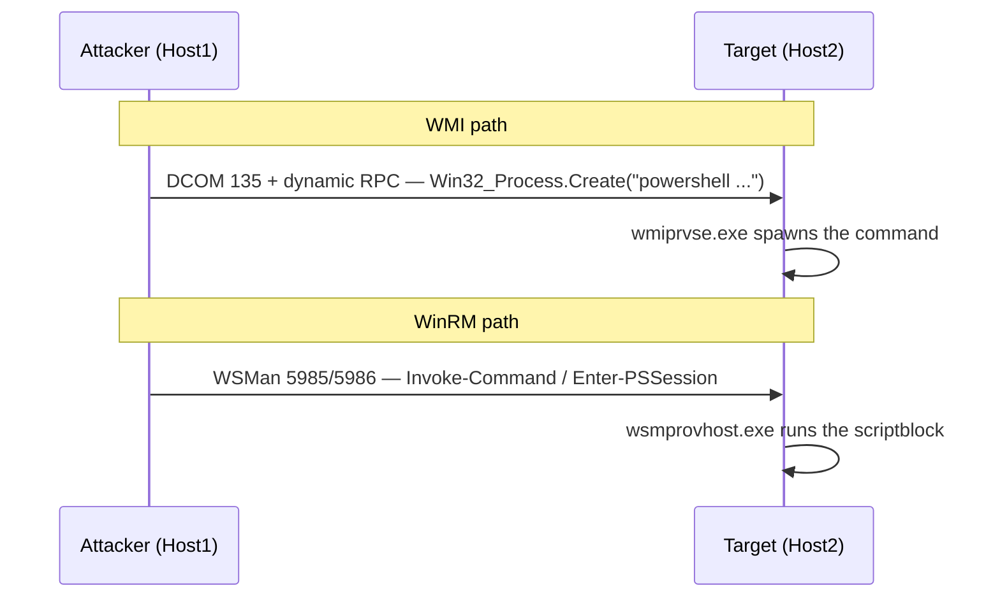

# WMI & WinRM Execution

<div class="dfir-meta" markdown>
**MITRE ATT&CK:** T1047 (Windows Management Instrumentation) + T1021.006 (Windows Remote Management) · **Tactic:** Execution / Lateral Movement · **Last updated:** 2026-09-17
</div>

!!! abstract "Summary"
    WMI and WinRM are built-in remote-management channels. **WMI** (over DCOM, port 135 + dynamic RPC) lets an attacker spawn a process on a remote host via `Win32_Process.Create` — no binary dropped, execution appears under `wmiprvse.exe`. **WinRM/PowerShell Remoting** (WSMan over HTTP **5985** / HTTPS **5986**) runs commands under `wsmprovhost.exe`. Both are "fileless" lateral movement that blends into legitimate admin traffic.

## How the attack works



Neither drops a service binary (unlike [PsExec](psexec-smb.md)), so the file-system trail is thin — the evidence is the **parent process** on the target and the auth/protocol logs.

## Attacker tooling / commands

```text
# WMI
wmic /node:HOST2 /user:CORP\admin process call create "powershell -enc <b64>"
Invoke-WmiMethod -ComputerName HOST2 -Class Win32_Process -Name Create -ArgumentList "cmd /c ..."
wmiexec.py CORP/admin@10.0.0.5 -hashes :<hash>       # Impacket
# Cobalt Strike:  jump winrm / remote-exec wmi

# WinRM / PS Remoting
Invoke-Command -ComputerName HOST2 -ScriptBlock { whoami }
Enter-PSSession -ComputerName HOST2
evil-winrm -i 10.0.0.5 -u admin -H <hash>            # PtH over WinRM
```

## Artifacts left behind

| Where | Artifact | What to look for |
|---|---|---|
| **Target** Sysmon | **1** with `ParentImage = ...\wmiprvse.exe` (WMI) or `...\wsmprovhost.exe` (WinRM) | These parents spawning `cmd`/`powershell`/anything = remote exec |
| Target Security log | **4624 Logon Type 3** (both), the account used | Inbound network logon |
| Target WinRM channel | `Microsoft-Windows-WinRM/Operational` **91** (session created), **168** (authenticating user) | WinRM server-side |
| Target WMI channel | `Microsoft-Windows-WMI-Activity/Operational` **5857–5861** | WMI provider load / operation; **5861** = new **permanent** consumer (persistence, not just exec) |
| Target PowerShell | **4104** (script block), **400** (engine start with `HostApplication`) | What was actually run |
| Target host | [Prefetch](../windows/prefetch.md) `WMIPRVSE.EXE`/`WSMPROVHOST.EXE`; **4688** with those parents | Execution evidence |
| **Source** host | **4648** (explicit creds), Sysmon 1 for `wmic.exe`/`Invoke-Command`, PowerShell history | Origin |
| Network | [Zeek `conn.log`](../network/zeek/conn-log.md) internal→internal `135`+dynamic (WMI) or `5985/5986` (WinRM); [`dce_rpc.log`](../network/zeek/index.md) for `IWbemServices`; WinRM shows as `http`/`ssl` on 5985/5986 | Protocol footprint |

!!! warning "wmiprvse/wsmprovhost are normal — the child is the tell"
    `wmiprvse.exe` and `wsmprovhost.exe` run legitimately all the time. The anomaly is what they **spawn**: an interactive shell, an encoded PowerShell, a discovery command (`whoami`, `net`, `nltest`), or anything writing to disk. Baseline normal WMI/WinRM parents so those stand out.

## Detection

=== "Splunk — remote-exec by parent"

    ```spl
    index=botsv3 sourcetype="XmlWinEventLog:Microsoft-Windows-Sysmon/Operational" EventID=1
        (ParentImage="*\\wmiprvse.exe" OR ParentImage="*\\wsmprovhost.exe")
    | eval method=if(match(ParentImage,"wmiprvse"),"WMI","WinRM")
    | table _time, host, method, User, ParentImage, Image, CommandLine
    | sort 0 _time
    ```

    Sysmon `1` = process create. Filtering on the two remote-management parents surfaces every process launched via WMI or WinRM on the target; `method` labels which channel. In a clean environment most of these are benign management tools — read `Image`/`CommandLine` and flag shells, encoded PowerShell, and discovery.

=== "Splunk — WMI persistence (event consumers)"

    ```spl
    index=botsv3 (sourcetype="XmlWinEventLog:Microsoft-Windows-Sysmon/Operational" EventID IN (19,20,21))
    | eval kind=case(EventID==19,"WMI Filter",EventID==20,"WMI Consumer",EventID==21,"WMI Binding")
    | table _time, host, kind, User, Operation, EventNamespace, Name, Query, Destination
    | sort 0 _time
    ```

    Sysmon `19` (event filter), `20` (event consumer), `21` (filter-to-consumer binding) together are the classic **fileless WMI persistence** — a filter (e.g. "on system startup") bound to a consumer that runs a script. Any `20`/`21` outside change windows deserves scrutiny.

=== "Zeek — WinRM & WMI on the wire"

    ```bash
    # WinRM (5985/5986) internal->internal
    zeek-cut -d ts id.orig_h id.resp_h id.resp_p service < conn.log | awk '($4==5985 || $4==5986) && $2 ~ /^10\./ && $3 ~ /^10\./'
    # WMI: DCE-RPC IWbemServices
    zeek-cut -d ts id.orig_h id.resp_h operation < dce_rpc.log | grep -iE 'IWbemServices|ExecMethod'
    ```

    WinRM is HTTP(S) on 5985/5986 — easy to spot internal→internal. WMI rides DCOM/RPC; `dce_rpc.log` records the `IWbemServices`/`ExecMethod` operations that back `Win32_Process.Create`.

## Response

Isolate the target, rotate the account used, and hunt every host where that account made a type-3 logon. Because there's no dropped binary, the durable evidence is the **parent-process** relationship and the WinRM/WMI operational logs — collect those plus PowerShell 4104. If Sysmon 19/20/21 show WMI persistence, remove the filter/consumer/binding (`Get-WmiObject -Namespace root\subscription -Class __EventFilter` etc.) and check other hosts for the same subscription. Harden: restrict WinRM to management subnets and jump hosts, enable PowerShell script-block logging fleet-wide, deploy Sysmon with WMI-subscription and suspicious-parent rules, disable WMI/WinRM where not needed, and tier admin accounts.

## References

- [MITRE ATT&CK — T1047](https://attack.mitre.org/techniques/T1047/) · [T1021.006](https://attack.mitre.org/techniques/T1021/006/)
- [Mandiant — WMI for detection and response](https://www.mandiant.com/resources/blog)
- Pages: [PsExec & SMB](psexec-smb.md) · [PowerShell cradles](powershell-cradles.md) · [Windows Event IDs](../basics/windows-event-ids.md) · [Security searches](../splunk/security-searches.md)
