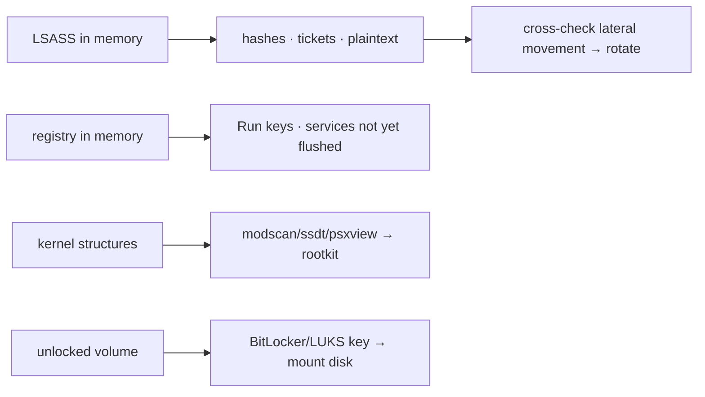

# Credentials, Registry & Rootkits in Memory

<div class="dfir-meta" markdown>
**Category:** Memory forensics · **Last updated:** 2026-09-17
</div>

!!! abstract "In one sentence"
    RAM holds things the disk doesn't or can't: the **secrets in LSASS** an attacker came for, the **registry as it was live** (including keys not yet flushed), **BitLocker/LUKS keys** while the volume is unlocked, and the **kernel structures** a rootkit tampered with — all recoverable from a memory image.

## Credentials in memory

Memory is where credential theft happens ([LSASS dumping](../adversary/lsass-dumping.md)) and where the secrets sit:

```bash
vol -f mem.raw windows.hashdump                   # local SAM account NT hashes
vol -f mem.raw windows.lsadump                     # LSA secrets (service account passwords, DPAPI keys, cached creds)
vol -f mem.raw windows.cachedump                   # cached domain credentials (MSCACHE)
```

- **`hashdump`** pulls NT hashes for local accounts from the SAM+SYSTEM hives in memory — feeds [Pass-the-Hash](../adversary/pass-the-hash.md) analysis (and shows what an attacker who dumped this image could reuse).
- **`lsadump`** recovers LSA secrets: service account plaintext passwords, machine account, DPAPI master keys, auto-logon passwords.
- **`cachedump`** gets cached domain logons (the hashes used when the DC is unreachable) — crackable offline.

Beyond the plugins, LSASS process memory itself (`memmap --pid <lsass> --dump`) can be carried into **Mimikatz** (`sekurlsa::minidump`) or **pypykatz** to extract Kerberos tickets, WDigest plaintext (if enabled), and more — the same material an attacker's [LSASS dump](../adversary/lsass-dumping.md) yields.

```bash
# Extract LSASS and parse offline with pypykatz (no Mimikatz needed)
vol -f mem.raw windows.memmap --pid <lsass_pid> --dump --output-dir ./lsass
pypykatz lsa minidump ./lsass/*.dmp
```

!!! tip "Whose creds, and were they used?"
    Anything recoverable here, the attacker who imaged (or dumped) this box also got. Treat every credential in the output as compromised, cross-reference to [lateral movement](../adversary/pass-the-hash.md) to see if they were reused, and rotate — see the [domain compromise playbook](../playbooks/lateral-domain.md).

## The registry, live

The registry in memory reflects the **running** state — including values written but not yet flushed to the hive on disk, and volatile keys that never hit disk:

```bash
vol -f mem.raw windows.registry.hivelist                          # hives mapped in memory + their offsets
vol -f mem.raw windows.registry.printkey --key "Software\\Microsoft\\Windows\\CurrentVersion\\Run"
vol -f mem.raw windows.registry.printkey --offset 0x... --key "..."   # target a specific hive
vol -f mem.raw windows.registry.userassist                        # UserAssist (GUI program execution) from memory
```

Why memory beats the disk hive sometimes: a value the attacker set moments before you imaged may only exist in memory (not yet flushed); `CurrentControlSet` resolves correctly (it's a live symlink); and volatile keys (`HKLM\SYSTEM\CurrentControlSet\Control\...` runtime state, some malware config) exist only here. Cross-reference with the on-disk [registry analysis](../windows/registry-keys.md).

## Disk-encryption keys

While a BitLocker/LUKS/FileVault volume is **mounted**, its keys are in RAM. A memory image captured on a live, unlocked machine can yield them — which is exactly why you [image RAM before powering off](../tools/imaging-collection.md) an encrypted host:

- **BitLocker**: tools like `Elcomsoft Forensic Disk Decryptor` or `bulk_extractor` can carve the FVEK from a memory image; Volatility community plugins exist.
- **LUKS**: the master key is in the kernel keyring / dm-crypt structures in RAM.
- Once you have the key, mount the disk image for full analysis; without it, a powered-off encrypted disk is just ciphertext.

## Rootkits & kernel tampering

Memory is the place to catch kernel-level manipulation that hides from every userland tool:

```bash
vol -f mem.raw windows.modscan                    # scan for kernel modules (finds UNLINKED = hidden driver)
vol -f mem.raw windows.ssdt                         # System Service Descriptor Table — hooks = tampering
vol -f mem.raw windows.driverirp                    # driver IRP hooks
vol -f mem.raw windows.callbacks                    # kernel callbacks (some rootkits register here)
vol -f mem.raw windows.psxview                       # cross-view: process visible to some sources, hidden from others
```

- **`modscan` vs `modules`**: a driver in the scan but not the list was unlinked (DKOM) — a hidden rootkit driver.
- **`ssdt`**: entries pointing outside known modules = the classic system-call hook a rootkit uses to intercept and hide.
- **`psxview`**: lists each process across multiple enumeration methods (pslist, psscan, thread scan, handle table, etc.); a process **visible in some columns but hidden in others** is being actively concealed — a strong rootkit/hiding signal.

## Bringing it together



Memory answers "what secrets were exposed, what config was live, and is something hiding at the kernel level" — the questions disk forensics can't. Then everything pivots back: creds → [lateral movement](../adversary/pass-the-hash.md), registry → [persistence](../adversary/persistence.md), keys → the disk image, rootkit → the driver file on disk.

## References

- [Volatility 3 — registry, hashdump, lsadump, modscan, ssdt, psxview](https://volatility3.readthedocs.io/en/latest/volatility3.plugins.html)
- [pypykatz (parse LSASS offline)](https://github.com/skelsec/pypykatz)
- [The Art of Memory Forensics](https://www.memoryanalysis.net/amf)
- Pages: [LSASS dumping](../adversary/lsass-dumping.md) · [Pass-the-Hash](../adversary/pass-the-hash.md) · [Registry keys](../windows/registry-keys.md) · [Domain compromise playbook](../playbooks/lateral-domain.md) · [Imaging](../tools/imaging-collection.md)
