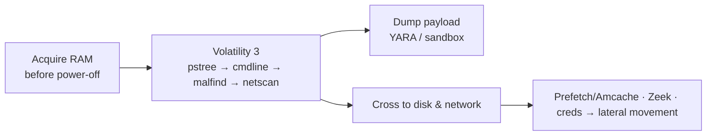

# Memory Forensics

Acquisition and analysis of volatile memory with Volatility 3. Memory answers what disk and logs can't — what was **running**, including fileless and injected code — but only for the instant it was captured, so it complements the timeline rather than replacing it.

## Why memory

| Only memory reliably shows… | Because |
|---|---|
| **Fileless / injected malware** | Never touched disk — lives in a legit process's memory ([injection](processes-injection.md)) |
| **Actual running processes** incl. hidden ones | `psscan`/`psxview` beat a rootkit's unlinked list |
| **What a process ran** (full command line, decoded) | `cmdline` recovers encoded PowerShell, C2 URLs |
| **Live network connections** incl. closed/hidden | `netscan` carves them from RAM |
| **Credentials in LSASS** | NT hashes, Kerberos tickets, plaintext ([credentials](credentials-registry.md)) |
| **Disk-encryption keys** | In RAM while the volume is unlocked — image before power-off |
| **Kernel rootkit tampering** | SSDT hooks, unlinked drivers — invisible to userland |
| **Registry not yet flushed to disk** | Values written moments before capture |

## Question → page

| Question | Page |
|---|---|
| How do I run Volatility 3, which plugin for what? | [Volatility 3 workflow](volatility-workflow.md) |
| Is there injected / fileless / hollowed code? Which process is evil? | [Processes & injection](processes-injection.md) |
| What credentials were exposed? What was in the live registry? Is there a rootkit? | [Credentials, registry & rootkits](credentials-registry.md) |
| How do I capture RAM in the first place? | [Imaging & acquisition](../tools/imaging-collection.md) |

## Pages

-   **[Volatility 3 workflow](volatility-workflow.md)** — setup, symbols, the plugin-by-question order, reading the results
-   **[Processes & injection](processes-injection.md)** — process-tree anomalies, `malfind`, hollowing, injection tells
-   **[Credentials, registry & rootkits](credentials-registry.md)** — hashdump/lsadump, live registry, encryption keys, kernel tampering

## Where it sits in the investigation

Capture RAM first (it's the most volatile evidence and the only source for the items above), work the [Volatility workflow](volatility-workflow.md), then pivot every finding back to disk artifacts ([Windows](../windows/index.md)), network ([Zeek/Arkime](../network/index.md)), and the [adversary techniques](../adversary/index.md) that produced it. If the box has an unlocked encrypted disk, the RAM image is also your only shot at the key.

!!! info "Adding a page here"
    `python new.py memory/<name> -t concept` — it appears in the sidebar automatically.
