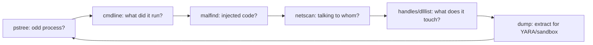

# Volatility 3 Workflow

<div class="dfir-meta" markdown>
**Category:** Memory forensics · **Tool:** Volatility 3 · **Last updated:** 2026-09-17
</div>

!!! abstract "In one sentence"
    Volatility 3 parses a RAM image into the OS structures the running system held — processes, network connections, loaded modules, injected code, registry hives in memory, credentials — answering questions **no disk artifact can**, because it sees what was *running*, including fileless malware that never touched disk. This page is the plugin-by-question workflow; [acquisition](../tools/imaging-collection.md) comes first.

## Setup

```bash
pip install volatility3          # or: git clone + pip install -e .
vol -h                            # 'vol' or 'python3 vol.py'

# Volatility 3 auto-detects the OS and builds symbols on the fly (no --profile like v2)
vol -f mem.raw windows.info      # confirm it reads the image + OS build
vol -f mem.raw banners.Banners   # Linux/Mac: find the kernel banner → get matching ISF symbols
```

Volatility 3 dropped v2's profiles — it identifies the OS automatically and downloads/generates symbol tables (ISF). For **Linux/macOS** you usually need the matching symbol table: get the kernel banner with `banners.Banners`, then place the correct ISF JSON in the symbols path (or build it with `dwarf2json`).

## The workflow — plugin by question

Run these roughly in order; each answer feeds the next.

### 1. Orient

```bash
vol -f mem.raw windows.info                    # OS, build, arch, time the image was taken
vol -f mem.raw windows.pslist                  # processes from the linked list (EPROCESS)
vol -f mem.raw windows.pstree                   # the same, as a parent/child tree — read this
```

`pstree` is where you start reading: look for the [suspicious parent→child pairs](../adversary/phishing-delivery.md) (Office→shell, `services.exe`→odd child), processes with no parent, or duplicate `lsass`/`svchost`.

### 2. Find hidden processes

```bash
vol -f mem.raw windows.psscan                   # scans memory for EPROCESS signatures — finds UNLINKED (hidden) procs
# Compare pslist vs psscan: anything in psscan but NOT pslist was hidden (DKOM rootkit / terminated)
```

`pslist` walks the OS's own process list (which a rootkit can unlink to hide); `psscan` carves process objects from raw memory regardless of the list. A process in `psscan` but not `pslist` was either **hidden** or recently exited — both worth a look.

### 3. Command lines & handles

```bash
vol -f mem.raw windows.cmdline                  # full command line per process — the "what ran" gold
vol -f mem.raw windows.dlllist --pid 1234       # DLLs loaded by a process
vol -f mem.raw windows.handles --pid 1234       # files, keys, mutexes it holds (mutex = malware family marker)
vol -f mem.raw windows.getsids --pid 1234       # which user/SID it runs as
```

`cmdline` often recovers the encoded PowerShell, the C2 URL, or the tool arguments that disk artifacts only hint at.

### 4. Injection & malicious code

```bash
vol -f mem.raw windows.malfind                  # regions of memory that are RWX / private+executable with no backing file
vol -f mem.raw windows.malfind --dump           # dump those regions for YARA / disassembly
vol -f mem.raw windows.hollowprocesses          # process hollowing detection (image mismatch)
vol -f mem.raw windows.ldrmodules               # DLLs in memory NOT in the 3 PEB load lists (unlinked/injected)
```

`malfind` is the workhorse for [code injection](processes-injection.md): it finds executable memory that isn't a legitimately-loaded module (shellcode, reflectively-loaded payloads, Cobalt Strike beacons). See the injection page for reading its output.

### 5. Network

```bash
vol -f mem.raw windows.netscan                  # TCP/UDP endpoints + owning PID (even closed/hidden ones)
vol -f mem.raw windows.netstat                  # active connections
```

`netscan` recovers connections the live `netstat` might have missed or that were closed — pivot the destination IPs to [beaconing/C2](../network/beaconing-c2.md) and the owning PID back to `pstree`.

### 6. Persistence & modules

```bash
vol -f mem.raw windows.svcscan                  # services (incl. hidden) with binary paths
vol -f mem.raw windows.modules                   # loaded kernel modules (list)
vol -f mem.raw windows.modscan                    # scan for modules (finds unlinked = rootkit)
vol -f mem.raw windows.ssdt                       # SSDT hooks (kernel rootkit tampering)
vol -f mem.raw windows.registry.printkey --key "Software\\Microsoft\\Windows\\CurrentVersion\\Run"
```

### 7. Credentials & registry

```bash
vol -f mem.raw windows.registry.hivelist          # registry hives mapped in memory
vol -f mem.raw windows.hashdump                   # SAM local account NT hashes
vol -f mem.raw windows.lsadump                     # LSA secrets
vol -f mem.raw windows.cachedump                   # cached domain creds
```

See [credentials & registry](credentials-registry.md) — memory is where Mimikatz-style secrets and unlocked-disk keys live.

### 8. Extract for deeper analysis

```bash
vol -f mem.raw windows.dumpfiles --pid 1234        # cached files from a process's memory
vol -f mem.raw windows.pslist --dump               # dump process executables
vol -f mem.raw windows.memmap --pid 1234 --dump     # full address space of a process
# Then: strings, YARA, upload the dumped payload to a sandbox / VT
```

## Reading the results — the loop



Anchor on one suspicious process from `pstree`, then walk its command line, injected regions, network, handles, and finally dump it. Cross to disk artifacts: the PID's image path → [Prefetch/Amcache](../windows/prefetch.md), the network IPs → [Zeek](../network/index.md), the credentials → [lateral movement](../adversary/pass-the-hash.md).

## Gotchas

- **Symbols for Linux/macOS**: no ISF = no analysis. Get the banner, match/build the symbol table first.
- **Acquisition quality**: a smeared image (taken while the system was very busy, or with a bad tool) yields inconsistent structures — pslist/psscan disagree wildly for the wrong reason. Use a reliable [acquirer](../tools/imaging-collection.md) and grab the pagefile too.
- **Time**: `windows.info` gives the image time; process timestamps are UTC.
- **v2 vs v3 plugin names differ**: v3 uses `windows.pslist.PsList` style (the short `windows.pslist` works); old blog posts using `--profile` and `pslist` are Volatility **2**.
- Memory shows the moment of capture only — it complements, not replaces, disk/log timelines.

## References

- [Volatility 3 documentation](https://volatility3.readthedocs.io/)
- [Volatility 3 plugin list](https://volatility3.readthedocs.io/en/latest/volatility3.plugins.html)
- [dwarf2json (build Linux/Mac symbols)](https://github.com/volatilityfoundation/dwarf2json)
- Pages: [Imaging & acquisition](../tools/imaging-collection.md) · [Processes & injection](processes-injection.md) · [Credentials & registry](credentials-registry.md)
