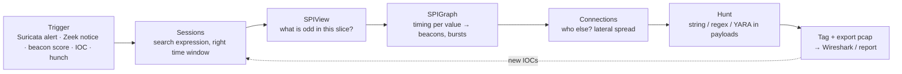

# Intrusion Detection with Arkime

**Category:** Hunting workflows · **Tool:** Arkime + Suricata + WISE · **Last updated:** 2026-09-16

!!! abstract "In one sentence"
    Arkime is not a signature engine — it is the place where an alert, a Zeek anomaly or a hunch becomes **evidence**: you find the sessions, see who else talked to the same thing, search the payloads for the string that proves it, and download the pcap. This page is the set of repeatable workflows for doing that, plus how Suricata and WISE plug in so detection and retrieval live in one screen.

## The core loop

Every step narrows or widens the same **expression** — keep it in a notes file as you go; the final expression *is* your evidence query.

## Workflow 1 — From a Suricata alert to proof

Suricata alerts can be written into Arkime sessions by the **suricata viewer plugin** (reads `eve.json`, matches on 5-tuple + time, adds `suricata.*` fields). Then:

1. **Find alerted sessions**: `suricata.severity == 1 && ip.src == 10.0.0.0/8` (or `suricata.signature == "*ET MALWARE*"`). Set the time range around the alert.
2. **Open the session** → expand → read the decoded payload. For HTTP you see request/response; for TLS you see the handshake (SNI, cert, JA3). Decide: true positive?
3. **Widen**: right-click the destination IP → `ip.dst == X` with the time range set to a week. Did other hosts talk to it? When did it start?
4. **Check the same host's other traffic** just before and after the alert: `ip.src == <victim>` in ±10 min. Look for the DNS query, the download, the follow-up beacon.
5. **Tag** the sessions (`Actions → Add Tags`, e.g. `inc-2026-0916-c2`) so everyone finds them later, and **Export PCAP** for the report.

!!! tip
    False-positive-heavy rules become obvious in SPIView: `suricata.signature` top values with hundreds of hits on internal → internal traffic. Sort by count, look at the tail instead — rare signatures are where the real stuff hides.

## Workflow 2 — Beacon hunting with SPIGraph

1. Expression: internal → external, common C2 ports, exclude your allow-list:
   `ip.src == 10.0.0.0/8 && ip.dst != 10.0.0.0/8 && port.dst == [443, 80, 8443, 8080] && ip.dst != $known_saas`
2. **SPIGraph → field `ip.dst`** (or `host.tls`, `host.http`), time range 24 h, **bucket 1–5 min**. Each row is a destination with its own mini-timeline. A **comb** — evenly spaced bars of identical height all day and night — is a beacon; browsing looks like clumps in working hours.
3. Click the comb → it becomes `ip.dst == X`. Now **SPIView**: how many `ip.src` (one host = suspicious; 500 = SaaS), `tls.ja3` (one fingerprint), `cert.issuer.cn` (self-signed? fresh Let's Encrypt?), `http.user-agent`, `databytes.src`/`.dst` distribution (constant tiny size = idle check-ins).
4. **Sessions** sorted by time: read the intervals directly (Arkime shows start times; constant 60 s ± jitter). Use `session.segments`/`rootId` if it is one long connection instead.
5. Corroborate with [Zeek interval analysis / RITA](../beaconing-c2.md), then go to the host (Sysmon 3 → process).

Fields that expose implants even when they look like browsers: `http.request.header` (missing `accept-language`/`referer`), `tls.ja3` shared with nothing else in the fleet, `cert.validfor` tiny, `host.tls != EXISTS!` on 443, `http.user-agent` in the "MSIE 7/9 on Windows 6.1" family on a Win11 estate.

## Workflow 3 — Lateral movement with Connections

1. Expression: `ip.src == 10.0.0.0/8 && ip.dst == 10.0.0.0/8 && port.dst == [445, 135, 139, 3389, 5985, 5986, 22]` in the incident window.
2. **Connections** view, source `ip.src`, destination `ip.dst`, weight by sessions. A **star** (one host fanning out to dozens) = admin jump box *or* the attacker's pivot; a **chain** (A→B→C→D over hours) = hands-on-keyboard movement.
3. Switch destination field to `smb.user` or `krb5.cname` → *which account* moved. One account touching many hosts = compromised credential; a service account interactive on workstations = misuse.
4. Drill in: `protocols == smb && smb.fn == [*.exe, *.dll, *.ps1, *PSEXESVC*] && smb.share == *ADMIN$*` → tool staging; `protocols == dcerpc && ip.dst == <target>` right after → service creation (export pcap, Wireshark `svcctl.opnum == 12`). `port.dst == 5985` → WinRM; `port.dst == 3389 && session.length > 600000` → RDP sessions worth pairing with `4624 type 10`.
5. Tag the path; hand the host list to the endpoint team ([Prefetch](../../windows/prefetch.md) for `psexesvc`/`wsmprovhost`, `7045`, `4624 type 3`).

## Workflow 4 — Hunt: searching payloads for a string

Hunts run **inside the packets** of matching sessions, not the SPI. Use them for things Arkime doesn't index: a command string, a web-shell parameter, a hostname inside a binary, a YARA rule.

1. **Hunt** tab → *Create a Hunt*. Name it (`hunt-webshell-cmd`). Scope with an **expression** (`protocols == http && ip.dst == <webserver>`) and a **time range** — narrower scope = minutes instead of hours.
2. Choose type: **ASCII** (case-insensitive option), **hex**, **regex**, **YARA** (paste rule). Choose **src / dst / both** payload direction. Limit packets per session if you only need the start.
3. Run. Matches are **tagged** (`huntId:<name>`) and listed; sessions can be opened straight from the hunt.
4. Typical hunts: `cmd.exe /c`, `powershell -enc`, `whoami`, `net user`, `mimikatz`, `IEX(`, `FromBase64String`, a leaked API key or hostname, `MZ` in HTTP response bodies to a non-executable URI, `PSEXESVC`, a known C2 URI pattern, YARA for a beacon config.
5. Hunts are heavy — they read pcap from disk. Run them on a narrowed expression, off-peak, and check **Stats** for I/O impact on a production sensor.

## Workflow 5 — IOC sweep (IP / domain / hash / JA3 / cert)

| IOC type | Expression | Widen with |
|---|---|---|
| IP | `ip == 203.0.113.7` | `asn.dst == "*<same ASN>*"`, `country.dst` |
| Domain | `host == *evil.example*` (covers `host.dns`, `host.http`, `host.tls`, `host.email`) | `dns.ip` from the answers → `ip.dst == [answers]` |
| URL path | `http.uri == */gate.php*` | `http.user-agent`, `http.request.header` of the hits |
| JA3 / JA4 | `tls.ja3 == <hash>` | SPIView `ip.dst`, `host.tls` — where else this client software goes |
| Cert | `cert.hash == <sha1>` or `cert.serial == …` or `cert.subject.cn == …` | `cert.issuer.cn`, other IPs presenting it over time |
| File hash | `http.md5 == …`, `email.md5 == …` (if body hashing on) | `http.bodymagic`, `email.fn` |
| SSH client | `ssh.hassh == <hash>` | `ssh.ver`, destinations |
| Community ID (from Zeek/Suricata) | `communityId == "1:…"` | direct pivot |

Save reusable lists as **Shortcuts** (`$c2_ips`, `$known_saas`) and reference them in expressions; feed intel automatically with **WISE**.

## Workflow 6 — Exfiltration

1. `ip.src == 10.0.0.0/8 && ip.dst != 10.0.0.0/8 && databytes.src > 50000000` — sessions where an internal host **sent** > 50 MB.
2. SPIView on `ip.dst`, `host.tls`, `host.http`, `asn.dst`: cloud storage and mail are expected; a VPS, a residential ASN, or a country you don't do business with is not.
3. Sum per host over a week with the **API** (`/api/sessions` with `fields=source.ip,destination.ip,source.bytes` piped to `jq`/`awk`) or SPIGraph on `ip.src` weighted by `databytes.src` to see *which hour*.
4. Protocol tells: `protocols == dns && databytes.src > 100000` (DNS tunnel), `protocols == ssh && session.length > 3600000` (long SSH tunnel), `port.dst == 443 && protocols != tls` (something else on 443), `http.method == PUT`, `protocols == ftp`.
5. Cross to the host: [SRUM](../../windows/srum.md) bytes per app for the same hour; [$UsnJrnl](../../windows/mft-usn.md) for the archive that was staged.

## Workflow 7 — Scanning & recon

- `ip.src == <host> && packets <= 3` → SPIView `ip.dst.cnt`/`port.dst` — thousands of distinct destinations or ports from one source in minutes.
- Connections view `ip.src → port.dst` shows a vertical scan as a fan of ports; `ip.src → ip.dst` shows a horizontal sweep.
- `protocols == ldap && ip.dst == <DC>` → SPIView `ip.src`: a workstation issuing thousands of LDAP queries = BloodHound/SharpHound.
- `protocols == krb5 && krb5.sname == EXISTS!` with one `krb5.cname` requesting dozens of distinct SPNs in seconds = Kerberoasting.
- `protocols == dns && dns.qt == PTR` bursts = reverse-lookup sweep.

## Making Arkime detect, not just retrieve

| Mechanism | What it gives you |
|---|---|
| **Suricata plugin** | Alerts as searchable session fields (`suricata.*`); sessions light up in the list |
| **WISE** | Real-time enrichment from threat feeds (IP/domain/hash/JA3/email), your own CSV/JSON lookups, Zeek-derived tags (`tagger`), reverse DNS, and **right-click actions** (VT, cont3xt, Shodan). Matches add fields/tags you can search: `tags == wise-c2feed` |
| **Cron Queries** | Run an expression every N minutes/hours; matching sessions are **tagged** and/or a **webhook/notifier** (Slack, email) fires — home-made alerting for behavioural rules (`host.tls != EXISTS! && port.dst == 443 && ip.dst != $known_saas`) |
| **Hunts** | On-demand or recurring payload searches; results tagged |
| **Views** | Saved expressions that filter the whole UI (e.g. `view: exclude-internal`) — build an "analyst view" that hides the noise by default |
| **Notifiers** | Where Cron Query / Hunt results go |

A minimal detection posture: Suricata ET Open rules ingested; WISE with 2–3 feeds and your IOC list; four or five Cron Queries for the behaviours above; Views that hide SaaS/update traffic; a weekly Hunt for your current threat's strings.

## Health checks before you believe a negative

- **Stats → Capture**: `Dropped packets`, `Overloaded drops`, `Fragments dropped` — non-zero means missing sessions and broken Hunts.
- **Stats → ES**: cluster health green; shards not red; disk watermark not hit (writes stop silently).
- **Files**: are pcap files still being written for the window you care about? `freeSpaceG` may have already expired them — SPI without pcap means you can search but not export.
- **Sensor placement**: inside NAT you see real client IPs; outside you see the firewall. Encrypted east-west (IPsec, WireGuard) appears as `esp`/`udp 51820` blobs.
- **Time**: sensor NTP-synced? Compare a known event's timestamp with the host log.

## References

- [Arkime — Hunts, Cron Queries, Views, WISE, Suricata plugin (docs & settings)](https://arkime.com/settings)
- [WISE service documentation](https://arkime.com/wise)
- [Community ID (Zeek / Suricata / Arkime shared flow hash)](https://github.com/corelight/community-id-spec)
- [65sch00l lessons 4–8 — Arkime advanced, Zeek+Arkime+Suricata integration, capstone](https://github.com/G1useppe/65sch00l)
- Related: [Search syntax](search-syntax.md) · [Beaconing & C2](../beaconing-c2.md) · [Zeek conn.log](../zeek/conn-log.md) · [Wireshark & tshark](../wireshark-tshark.md)
