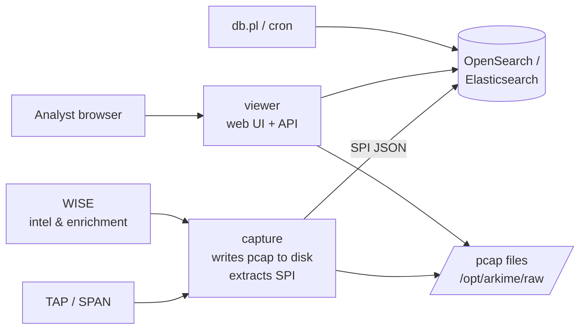

# Arkime

<div class="dfir-meta" markdown>
**Category:** Full-packet capture & indexing · **Platform:** Linux sensor + web UI · **Last updated:** 2026-09-16
</div>

!!! abstract "What it does"
    Arkime (formerly Moloch) captures **every packet** to disk, extracts per-session metadata (SPI — Session Profile Information) into **OpenSearch/Elasticsearch**, and gives you a web UI to search millions of sessions in seconds and pull the exact pcap for any of them. Zeek tells you *what happened*; Arkime lets you **prove it with the packets**, months later.

## How it fits with Zeek and Suricata

| | Zeek | Suricata | Arkime |
|---|---|---|---|
| Output | Structured logs per protocol | Alerts (signatures) + `eve.json` metadata | Indexed **sessions** + **full pcap** |
| Best at | Understanding & hunting in logs | Known-bad detection | Retrieving and searching raw traffic; visual pivoting |
| Retention | Text — cheap, long | Alerts — tiny | Pcap — expensive, days–weeks; SPI — weeks–months |
| Join key | `uid`, `community_id` | `flow_id`, `community_id` | Session `id`, `community_id`, 5-tuple + time |

The classic stack: Suricata alerts → look at the Zeek logs for context → open the session in Arkime → download the pcap → Wireshark. Arkime can ingest **Suricata alerts into the session record** (the `suricata` viewer plugin) and can be enriched by **WISE** (threat intel, Zeek-derived tags), so one search shows alert + session + intel together.

## Architecture (what's running where)



| Component | Role | Where |
|---|---|---|
| **capture** | Reads packets (AF_PACKET/PF_RING/DPDK or `-r` pcap files), reassembles sessions, extracts SPI, writes pcap, ships SPI to the DB | Sensor node(s) |
| **viewer** | Node.js web UI + REST API; serves pcap by reading the sensor's disk (or via other viewers in a cluster) | Sensor or central |
| **OpenSearch / Elasticsearch** | Stores SPI in daily/hourly `sessions3-*` indices; `files`, `stats`, `users`, `hunts`, `views` indices | Central |
| **WISE** | "With Intelligence See Everything" — enrichment plugin: threat feeds, Zeek-derived tags, custom lookups, right-click actions | Central |
| **cont3xt** (optional) | Indicator investigation UI, pivots from Arkime | Central |
| **Parliament** (optional) | Multi-cluster dashboard | Central |
| `db.pl` | Index maintenance, `expire` (keeps disk within limits), `upgrade`, `backup` | Cron on central |

**Retention** is two separate knobs: pcap on disk (`freeSpaceG` in `config.ini` → capture deletes oldest files) and SPI in the DB (`db.pl expire daily 30` style). You often keep SPI far longer than packets — metadata without pcap is still a great search.

## What a "session" is

A session is Arkime's unit of storage: a bidirectional flow (5-tuple) bounded by a timeout, with **hundreds of extracted fields** — IPs, ports, protocols, bytes/databytes/packets each direction, GeoIP/ASN, and protocol details: HTTP hosts/URIs/UAs/methods/status codes/headers, DNS names/answers, TLS SNI/JA3/JA4/versions/ciphers/certificates, SMB filenames/users, SSH versions/hashes, Kerberos/NTLM users, email addresses/subjects/filenames, DHCP hostnames, tags, Suricata alerts, WISE enrichments — plus the **byte offsets of its packets** so pcap can be reassembled on demand.

Important defaults: a long TCP connection is split into multiple sessions after `maxStreams`/`tcpTimeout`/`tcpSaveTimeout` (~8 min by default) — a 6-hour SSH tunnel shows as many sessions. UDP sessions time out quickly (`udpTimeout` 60 s). Use `rootId` to stitch a split connection together.

## The UI in one paragraph each

**Sessions** — the main list: time range picker, search expression box, one row per session, expand a row to see all SPI fields, packets, and reassembled payload (with per-protocol decoding for HTTP, SMTP, etc.). Right-click any value → filter, or send to WISE/cont3xt.

**SPIView** — every field with its top values and counts for the current search. The fastest way to see "what user agents exist in this traffic" or "which JA3s hit this IP". Click a value to add it to the expression.

**SPIGraph** — one field (e.g. `ip.dst`, `http.host`, `tls.ja3`) graphed over time, a mini-graph per value. This is where beacons draw combs.

**Connections** — force-directed graph of `src ↔ dst` for a chosen pair of fields (IP ↔ IP, IP ↔ `host.http`, user ↔ IP). Lateral movement is a picture here.

**Hunt** — search **packet payloads** (not just SPI) across many sessions: ASCII/hex/regex/YARA, optionally only sessions matching an expression. Results tag the sessions. This is how you find a string in three weeks of pcap.

**Files / Stats / Users / Settings / History / Cron Queries** — pcap file list, sensor health (drops!), accounts, saved views & shortcuts, your query history, and scheduled queries that tag sessions or post to a webhook when they match.

## Quick start on a lab box

```bash
# Ingest a pcap into a running instance (offline, keeps timestamps from the file)
/opt/arkime/bin/capture -c /opt/arkime/etc/config.ini -r /data/capture.pcap --copy
#  -R /dir      recurse a directory      --copy  copy pcap into Arkime's raw dir so viewer can serve it
#  --skip      skip files already processed (use with -R and a monitor cron)
#  -t tagname  tag every session from this file — do this per case/exercise

# Sanity: sessions arrived?
curl -s -u admin:pass 'http://localhost:8005/api/sessions?date=-1&expression=tags==case01&length=5' | jq '.data[] | {firstPacket, source, destination, protocol}'

# Reindex / maintenance / retention
/opt/arkime/db/db.pl http://localhost:9200 info
/opt/arkime/db/db.pl http://localhost:9200 expire daily 30       # keep 30 days of SPI
```

Check **Stats → Capture** for `Dropped` counters before trusting any negative result — a sensor dropping 20% of packets produces sessions with missing payload and silently broken Hunts.

## Pages

- [Search syntax cheat sheet](search-syntax.md) — the expression language, field names, time tricks
- [Intrusion detection & hunting workflows](hunting-workflows.md) — using Sessions, SPIView, SPIGraph, Connections and Hunt to find intrusions; Suricata/WISE integration

## References

- [Arkime documentation](https://arkime.com/) · [Settings reference](https://arkime.com/settings) · [API](https://arkime.com/apiv3)
- [Arkime FAQ (retention, sizing, drops)](https://arkime.com/faq)
- [65sch00l lessons 3–5 — Arkime basics, advanced, integration](https://github.com/G1useppe/65sch00l)
