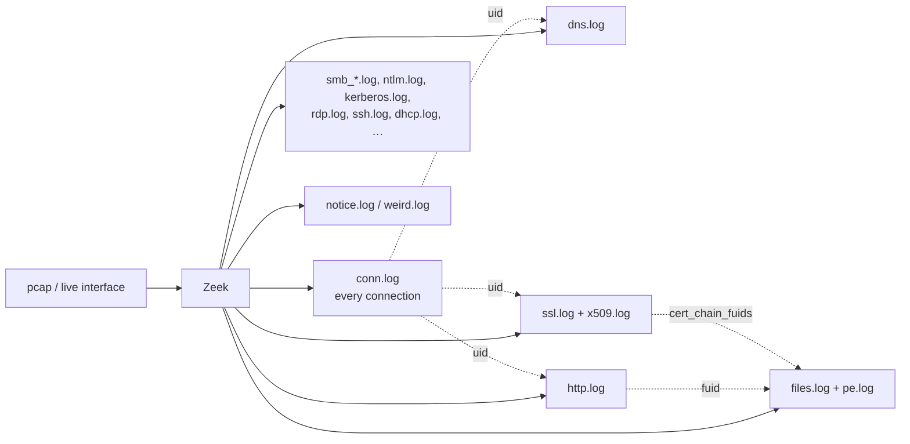

# Zeek

Zeek (formerly Bro) turns packets into **structured, protocol-aware logs** — one line per connection, DNS query, HTTP request, TLS handshake, file transfer. For network forensics it is usually more useful than the pcap itself, because you can grep a month of traffic in seconds and only go back to packets for the few flows that matter.

## How the logs fit together



Every log line about a connection carries the same **`uid`** (e.g. `CHhAvVGS1DHFjwGM9`) as its `conn.log` row — that is the join key. Files get a **`fuid`**; `http.log` (`orig_fuids`/`resp_fuids`), `smtp.log`, `ssl.log` (`cert_chain_fuids`) point to them. Hosts appear as `id.orig_h` (client) / `id.resp_h` (server), ports as `id.orig_p` / `id.resp_p`.

## Log files you will actually open

| Log | One line per… | Go there when you ask… |
|---|---|---|
| [`conn.log`](conn-log.md) | TCP/UDP/ICMP connection | Who talked to whom, how long, how much, was it a full handshake? |
| [`dns.log`](dns-log.md) | DNS query/response | What names were looked up, what did they resolve to, any tunnelling? |
| [`http.log`](http-log.md) | HTTP request/response pair | URIs, user agents, hosts, status codes, downloaded file IDs |
| [`ssl.log` / `x509.log`](ssl-x509.md) | TLS handshake / certificate | SNI, JA3/JA4, cert subject/issuer/validity, self-signed C2 certs |
| [`files.log` / `pe.log`](files-log.md) | File seen in any protocol / Windows executable | Hashes, MIME types, sizes, which connection carried the EXE |
| `notice.log` | Zeek "something interesting" | Scans, brute force, self-signed certs, invalid certs, SSH guesses |
| `weird.log` | Protocol anomalies | Malformed traffic, evasion, broken tooling |
| `smb_mapping.log`, `smb_files.log`, `ntlm.log`, `kerberos.log`, `dce_rpc.log` | Windows lateral-movement protocols | Share access, file ops over SMB, NTLM/Kerberos auth (users!), RPC calls (PsExec/WMI/service creation) |
| `rdp.log`, `ssh.log`, `ftp.log`, `smtp.log`, `dhcp.log`, `dpd.log`, `software.log`, `known_*.log` | as named | — |

## Reading logs — the two formats

=== "TSV (default in most setups)"

    ```bash
    # Headers start with '#'. #fields names the columns, #types their types.
    head -8 conn.log
    # #separator \x09
    # #set_separator ,
    # #empty_field  (empty)
    # #unset_field  -
    # #path conn
    # #open 2026-09-16-10-00-00
    # #fields ts uid id.orig_h id.orig_p id.resp_h id.resp_p proto service duration orig_bytes resp_bytes conn_state ...
    # #types  time string addr port addr port enum string interval count count string ...
    ```

    **zeek-cut** picks columns by name and can convert epoch → human time:

    ```bash
    zeek-cut -d ts id.orig_h id.resp_h id.resp_p service < conn.log | head
    #            ^-- -d = readable UTC time; -D "%Y-%m-%d %H:%M:%S" for a custom format; -u forces UTC
    ```

=== "JSON (`LogAscii::use_json=T`, Security Onion, Corelight)"

    ```bash
    # jq is your zeek-cut
    jq -r '[.ts, ."id.orig_h", ."id.resp_h", ."id.resp_p", .service] | @tsv' conn.log | head
    jq -c 'select(."id.resp_p"==445)' conn.log
    ```

    JSON logs go straight into Splunk / Elastic with field names intact — `id.resp_h` becomes a field you can `stats` on.

## Running Zeek on a pcap

```bash
# Writes *.log into the current directory. -C ignores bad checksums (common in lab captures / offloaded NICs).
zeek -C -r capture.pcap

# Use the local site policy (loads JA3/JA4, file hashing, etc. if installed) and a custom script
zeek -C -r capture.pcap local my-script.zeek

# Enable all file hashes (md5/sha1/sha256) — very useful, off by default for sha1/sha256
zeek -C -r capture.pcap local "Files::analyze_by_default" policy/frameworks/files/hash-all-files

# Extract every file Zeek sees into ./extract_files/
zeek -C -r capture.pcap policy/frameworks/files/extract-all-files
```

Time in logs is **UTC epoch** (`ts`). Zeek does not change time zones for you.

## Analysis reflexes

- **Start in `conn.log`**, aggregate (`sort | uniq -c`, or `stats count by` in Splunk), then pivot by `uid` into the protocol log for the outliers.
- **`service` is what Zeek *saw*, not the port.** `id.resp_p=443` with `service=-` or `service=ssh` is a story.
- **Long duration + small bytes** = interactive shell / keep-alive. **Regular intervals** = beacon (see [Beaconing & C2](../beaconing-c2.md)).
- **Bytes asymmetry**: `orig_bytes >> resp_bytes` on an outbound connection = upload / exfil.
- **`history`** string in `conn.log` tells you the handshake story — scans show `S` only, rejected shows `Sr`, data both ways shows `ShADadFf`.
- Zeek logs **do not contain payloads** — for the actual command or file content you go to the pcap ([Wireshark / tshark](../wireshark-tshark.md)) or `extract_files/`.

## References

- [Zeek documentation — log files](https://docs.zeek.org/en/master/logs/index.html)
- [Zeek log cheat sheets (Corelight)](https://corelight.com/resources/zeek-cheatsheets)
- [65sch00l lesson series — Zeek / Arkime / Suricata](https://github.com/G1useppe/65sch00l)
