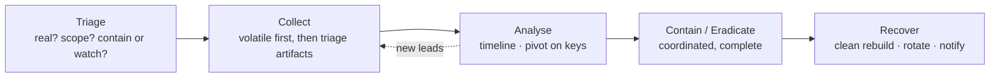

# Playbooks

Repeatable response procedures for common incident types. Each follows the same shape — **when to use → triage (first 15 min) → collect → analyse → contain/eradicate → recover → useful queries** — and links into the [Windows](../windows/index.md), [Network](../network/index.md), [Splunk](../splunk/index.md), [Adversary](../adversary/index.md) and [Tools](../tools/index.md) sections for the underlying detail.

## Pick a playbook

| If you're facing… | Playbook |
|---|---|
| Files encrypted / ransom note / mass rename | [Ransomware](ransomware.md) |
| One host: alert, suspicious process, user report | [Compromised workstation](compromised-workstation.md) |
| Suspicious sign-in, mailbox rule, fraud from a real account | [Account compromise & BEC](account-compromise.md) |
| Attacker moving host-to-host, or DC / Domain Admin compromise | [Lateral movement & domain compromise](lateral-domain.md) |
| Data theft — large uploads, staging archives, DLP alert | [Data exfiltration](data-exfiltration.md) |
| Web server: web shell, exploited app, RCE | [Web shell & server compromise](webshell-server.md) |

## The universal shape

Two principles run through all of them: **preserve volatile evidence before you remediate** (RAM, running state — you only get one chance), and **scope before you contain** (partial containment lets a live actor re-enter; find the full extent, then cut it all at once).

## First-15-minutes reflexes (any incident)

- Is it **real**? Read the actual detection before mobilising.
- What's the **scope so far** — hosts, accounts, data, time window?
- **Contain or watch?** If spreading, isolate (network-contain, keep RAM). If dormant and you need scope, watch quietly.
- **Preserve**: capture RAM / a sample / the key logs before anything changes them.
- **Escalate** the decisions that aren't yours: paying ransom, legal/regulatory notification, taking production down — those go to leadership/legal early.

## Pages

-   **[Ransomware](ransomware.md)** — encryption is stage N; reconstruct stages 1…N−1, protect backups, rotate krbtgt
-   **[Compromised workstation](compromised-workstation.md)** — first-responder triage order for a single host
-   **[Account compromise & BEC](account-compromise.md)** — cloud identity logs, inbox rules, token revocation, OAuth
-   **[Lateral movement & domain](lateral-domain.md)** — the movement graph, DCSync, golden tickets, coordinated reset
-   **[Data exfiltration](data-exfiltration.md)** — what/how much/where/when for notification decisions
-   **[Web shell & server](webshell-server.md)** — find every shell, close the vector, rotate secrets

!!! info "Adding a playbook"
    `python new.py playbooks/<name> -t playbook` — the template already has the triage→collect→analyse→contain→recover structure. It appears in the sidebar automatically.
