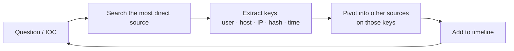

# BOTSv3 Investigation Workflow

<div class="dfir-meta" markdown>
**Category:** Splunk practice · **Dataset:** Boss of the SOC v3 (Frothly, Aug 2018) · **Last updated:** 2026-09-17
</div>

!!! abstract "In one sentence"
    BOTSv3 is a realistic multi-source incident dataset; the way to learn from it is not to memorise answers but to practise the **investigation loop** — identify the sources, pivot on shared keys, build timelines — so this page is the method and the map of the data, deliberately without solutions.

## Get oriented (do this first, every time)

```spl
| metadata type=sourcetypes index=botsv3
| eval first=strftime(firstTime,"%Y-%m-%d"), last=strftime(lastTime,"%Y-%m-%d")
| table sourcetype, totalCount, first, last | sort - totalCount
```

Note the date range — searches must use `earliest=0` or an absolute window in **August 2018**. Then list hosts:

```spl
| tstats count where index=botsv3 by host, sourcetype | sort - count
```

## Data map

| Source family | Sourcetypes (BOTSv3 names) | What you learn |
|---|---|---|
| Windows Security | `WinEventLog` (Security/System/Application via `source`), `XmlWinEventLog:*` | Logons, process creation, services, account changes, log clears |
| Sysmon | `XmlWinEventLog:Microsoft-Windows-Sysmon/Operational` | Process trees, network connections per process, file writes, registry, DNS (22) |
| PowerShell | `XmlWinEventLog:Microsoft-Windows-PowerShell/Operational` | Script block text `4104` |
| Wire data | `stream:tcp`, `stream:udp`, `stream:http`, `stream:dns`, `stream:smb`, `stream:smtp`, `stream:ip`, `stream:icmp`, `stream:ftp`, `stream:ldap`, `stream:mysql`, `stream:ssl` | Who talked to whom; HTTP URIs/UAs; DNS queries; SMB file names; mail |
| Cloud | `aws:cloudtrail`, `aws:cloudwatchlogs:vpcflow`, `aws:s3:accesslogs`, `aws:config`, `aws:metadata`, `aws:description` | API calls, who did what in AWS, S3 bucket access, VPC flows |
| M365 | `ms:o365:management`, `ms:o365:reporting:messagetrace`, `ms:aad:*` | Mailbox/SharePoint activity, mail trace, Azure AD sign-ins |
| Endpoint / inventory | `osquery:results`, `symantec:ep:*`, `code42:*` | Process/socket snapshots, AV detections, file exfil monitoring |
| Linux | `linux_secure`, `syslog`, `bash_history`?, `osquery` | SSH auth, sudo, commands |
| Web/app | `iis`, `apache:access`?, `nginx*`, `hadoop*`?, `mysql*` | Web server access, DB |
| Infra | `cisco:asa`?, `pan:*`?, `dhcpd`, `dns`? | Perimeter, DHCP leases |

(`?` = confirm on your instance with `metadata` — dataset apps differ slightly between versions.) The users, hostnames and IPs of the fictional company **Frothly** recur across all of these — that's the point.

## The investigation loop



Every answer you find yields new **keys**; every key opens other sourcetypes. Keys and where they pivot:

| Key | Pivots to |
|---|---|
| **Username** | `4624/4625/4648/4672` (Security), Sysmon `User`, `stream:smb` / `stream:ldap` user fields, `aws:cloudtrail userIdentity.*`, `ms:o365 UserId`, `linux_secure` |
| **Hostname** | `host=` across everything; Sysmon `Computer`; Security `Workstation_Name`; DHCP → IP |
| **IP** | `stream:*` `src_ip/dest_ip`; Security `Source_Network_Address`; Sysmon `3` `DestinationIp`; `aws:*:vpcflow`; firewall; `iplocation` |
| **Process / hash** | Sysmon `1` `Image`/`Hashes`; `4688`; osquery `columns.path`; Symantec; VirusTotal (out of band) |
| **File name** | Sysmon `11` `TargetFilename`; `stream:smb` `filename`; `stream:http` `uri_path`; `5145 Relative_Target_Name`; Code42 |
| **Domain / URL** | `stream:dns query`; `stream:http site/uri_path`; Sysmon `22` `QueryName`; proxy |
| **Time window** | Everything — build the host timeline ([Security searches → host timeline](security-searches.md#build-a-host-timeline-everything-about-one-machine)) |

## Step-by-step method for a BOTS question

1. **Rewrite the question as a field**: "which user…" → `Account_Name`/`User`/`user`; "what IP…" → `src_ip`/`Source_Network_Address`; "what file…" → `TargetFilename`/`uri_path`/`filename`; "when…" → `_time` + `convert ctime`.
2. **Pick the most direct sourcetype** from the data map. Search it with the narrowest filter you have; `| head 20` first to see the shape.
3. **`stats` before `table`**: `stats count by <candidate field>` — the answer is usually the odd value, not the common one.
4. **Confirm from a second source**. A username from `4624` should also appear in Sysmon `User` on that host; an IP from `stream:http` should appear in `stream:tcp` and maybe Sysmon `3`.
5. **Write down the key and the time** before moving on. Your notes become the timeline.
6. **Stuck? Widen** — remove one filter, extend time, or `fieldsummary` the sourcetype to see fields you didn't know existed.

## Useful "first look" searches per source

```spl
# Which users exist / are active (Security)
index=botsv3 sourcetype=WinEventLog EventCode=4624 earliest=0
| eval user=mvindex(Account_Name,1) | stats dc(host) as hosts, count by user | sort - count

# Which hosts run Sysmon, and how chatty
index=botsv3 sourcetype="XmlWinEventLog:Microsoft-Windows-Sysmon/Operational" earliest=0
| stats count by host, EventID | sort host, EventID

# Top external destinations (wire data)
index=botsv3 sourcetype=stream:tcp earliest=0
| where NOT cidrmatch("10.0.0.0/8",dest_ip) AND NOT cidrmatch("172.16.0.0/12",dest_ip) AND NOT cidrmatch("192.168.0.0/16",dest_ip)
| stats count, sum(bytes_out) as out by dest_ip, dest_port | sort - out

# HTTP sites and user agents
index=botsv3 sourcetype=stream:http earliest=0 | stats count by site, http_user_agent | sort - count

# DNS: rare names
index=botsv3 sourcetype=stream:dns earliest=0 record_type=A
| stats count by query | sort count | head 50

# AWS: who did what
index=botsv3 sourcetype=aws:cloudtrail earliest=0
| stats count by userIdentity.arn, eventName, sourceIPAddress | sort - count

# AWS: errors (recon / denied actions)
index=botsv3 sourcetype=aws:cloudtrail earliest=0 errorCode=*
| stats count by userIdentity.arn, eventName, errorCode

# M365: mail trace
index=botsv3 sourcetype=ms:o365:reporting:messagetrace earliest=0
| table _time, SenderAddress, RecipientAddress, Subject, Status

# osquery: processes with listening sockets
index=botsv3 sourcetype=osquery:results earliest=0 name=*listening* | spath | table _time, host, columns.name, columns.port, columns.path

# Symantec detections
index=botsv3 sourcetype=symantec:ep:security:file earliest=0 | table _time, host, Risk_Name, File_Path, Actual_Action

# Code42 (file exfil monitoring)
index=botsv3 sourcetype=code42:* earliest=0 | stats count by sourcetype | sort - count
```

Each is a `stats … by` of the two or three fields that define that source's story; run them once and you'll know which users, hosts and destinations matter before you read a single question.

## Multivalue & field traps specific to BOTS

- `Account_Name` is multivalue in `4624`/`4688` — use `mvindex`.
- `stream:http` has both `site` (Host header) and `dest_ip`; `uri_path` vs `url` vs `uri` — check which exists.
- `stream:dns` `query` can be multivalue; `record_type` filters A/TXT etc.
- Sysmon fields need the add-on; otherwise use `rex`/`spath` ([rex & fields](rex-and-fields.md)).
- CloudTrail fields are nested JSON: `userIdentity.arn`, `requestParameters.bucketName` — `spath` if auto-extraction is off.
- Time zone: display in UTC when comparing across cloud and on-prem sources.

## Turning a solved question into handbook content

When you finish a scenario, write one short entry (a `playbook` or `concept` page, or a row in a table here): the **question**, the **sourcetype and fields** that answered it, the **final SPL**, and **what a wrong turn looked like**. That converts a CTF hour into a reusable procedure for real incidents.

## References

- [BOTSv3 dataset & guide](https://github.com/splunk/botsv3)
- [Splunk BOTS overview](https://www.splunk.com/en_us/blog/security/boss-of-the-soc-scoring-server-questions-and-answers-and-dataset-open-sourced-and-ready-for-download.html)
- Pages: [Data discovery](data-discovery.md) · [SPL cheat sheet](spl-cheatsheet.md) · [Security searches](security-searches.md) · [Hunting patterns](hunting-patterns.md)
