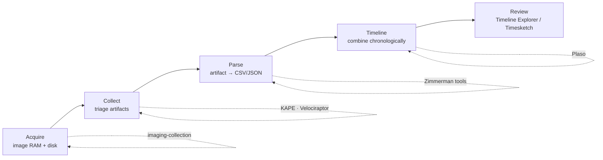

# Tools

The DFIR toolbox — what each tool is for, the commands that matter, and how they fit together. The chain is almost always **acquire → collect → parse → timeline → review**, and these pages cover each stage.

## The pipeline

## By stage

| Stage | Tool | Page |
|---|---|---|
| **Acquire** a defensible image (RAM + disk) | WinPmem, FTK Imager, dd/dc3dd, Guymager, AVML | [Imaging & collection](imaging-collection.md) |
| **Collect** triage artifacts from one host | KAPE (Targets) | [KAPE](kape.md) |
| **Collect / hunt** across the fleet, live | Velociraptor | [Velociraptor](velociraptor.md) |
| **Parse** artifacts to CSV | Eric Zimmerman suite (+ KAPE `!EZParser`) | [Zimmerman tools](zimmerman-tools.md) |
| **Timeline** everything at once | Plaso / log2timeline, Timesketch | [Plaso & timelines](plaso-timelines.md) |
| **Review** | Timeline Explorer | [Zimmerman tools](zimmerman-tools.md#timeline-explorer-the-review-front-end) |
| **Hunt** in EVTX with Sigma | Chainsaw, Hayabusa | [Event logs](../windows/event-logs.md#how-to-parse) |

## Which collector when?

| Situation | Use |
|---|---|
| One live/mounted Windows box, fast triage | [KAPE](kape.md) `!SANS_Triage` |
| Many endpoints, ask one question of all | [Velociraptor](velociraptor.md) hunt |
| Air-gapped / no server | [Velociraptor offline collector](velociraptor.md) or KAPE to USB |
| Need unallocated space, carving, court image | [Full disk image](imaging-collection.md) (E01) |
| Volatile data / encrypted disk unlocked | [RAM image first](imaging-collection.md), then [Memory forensics](../memory/index.md) |

## Pages

-   **[Imaging & collection](imaging-collection.md)** — order of volatility, RAM/disk imaging, E01 vs raw, write-blocking & hashing
-   **[KAPE](kape.md)** — Targets & Modules, `!SANS_Triage` + `!EZParser`, collect-on-host/parse-off-host
-   **[Velociraptor](velociraptor.md)** — VQL, artifacts, fleet hunts, offline collector
-   **[Zimmerman tools](zimmerman-tools.md)** — one parser per artifact, Timeline Explorer, cheat recipes
-   **[Plaso & super-timelines](plaso-timelines.md)** — log2timeline/psort, filtering, Timesketch

!!! info "Adding a tool"
    `python new.py tools/<name> -t tool` — the template has the cheat-sheet structure. It appears in the sidebar automatically.
