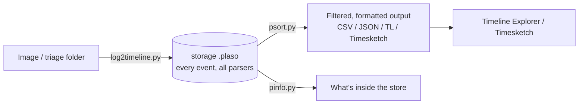

# Plaso & Super-Timelines

<div class="dfir-meta" markdown>
**Category:** Timelining · **Platform:** Linux / Windows / Docker · **Last updated:** 2026-09-17
</div>

!!! abstract "What it does"
    Plaso (`log2timeline`) parses **every timestamped artifact it can find** — file system, registry, event logs, browser, prefetch, and hundreds more — into one normalised timeline, so you can see everything that happened on a system in chronological order. A "super-timeline" answers *what happened, in what order* when you don't yet know where to look; the trade-off is volume, so filtering is the whole skill.

## The pipeline



- **`log2timeline.py`** ingests a source into a `.plaso` storage file (runs many parsers).
- **`psort.py`** post-processes: filter by time/parser/field, deduplicate, and output to a format.
- **`pinfo.py`** reports what a `.plaso` contains (parsers, counts, time range).
- **`psteal.py`** = log2timeline + psort in one command (quick end-to-end).

## Commands

```bash
# Ingest a mounted image or triage folder (Docker keeps deps clean)
log2timeline.py --storage-file case.plaso /evidence/

# Only the parsers you need (faster, smaller) — e.g. Windows triage
log2timeline.py --parsers "win7,!filestat" --storage-file case.plaso /evidence/
log2timeline.py --parsers "mft,usnjrnl,winevtx,winreg,prefetch,amcache,lnk,olecf" --storage-file case.plaso /evidence/

# See what's in the store
pinfo.py case.plaso

# Output a filtered CSV for Timeline Explorer (l2tcsv is the classic wide format)
psort.py -o l2tcsv -w timeline.csv case.plaso "date > '2026-08-20 00:00:00' AND date < '2026-08-21 00:00:00'"

# Only certain parsers / sources, dedupe
psort.py -o dynamic -w tl.csv case.plaso "parser contains 'winevtx' OR parser contains 'mft'"

# One-shot ingest + output
psteal.py --source /evidence/ -o l2tcsv -w timeline.csv

# Push straight into Timesketch for browser-based analysis
psort.py -o timesketch --name "Case01" case.plaso
```

Parser presets (`win7`, `winxp`, `linux`, `macos`, `webhist`) pull sensible groups; `--parsers` with `!name` excludes. `filestat` (one event per file MACB) is enormous — exclude it unless you need it.

## Filtering — the actual skill

A raw super-timeline is millions of rows; nobody reads that. You **anchor and window**:

```bash
# Everything within ±1 hour of a known-bad event, then read outward
psort.py -o l2tcsv -w window.csv case.plaso \
  "date > '2026-08-20 14:00:00' AND date < '2026-08-20 16:00:00'"

# Only execution/persistence-relevant sources
psort.py -o dynamic -w exec.csv case.plaso \
  "parser contains 'prefetch' OR parser contains 'amcache' OR parser contains 'winevtx' OR parser contains 'winreg'"
```

Then in **Timeline Explorer** (or Timesketch): filter the `source`/`parser` columns, search for the user/host/path, colour the rows that matter, and follow the sequence. The l2tcsv format's `MACB` column tells you whether each row is a Modified/Accessed/Changed/Born timestamp.

## Plaso vs. the Zimmerman timeline

| | Plaso super-timeline | [MFTECmd](zimmerman-tools.md) `--body` + others |
|---|---|---|
| Coverage | Everything, one file | Per-artifact CSVs you combine |
| Volume | Huge — must filter hard | Targeted — each CSV is readable |
| Best when | You don't know where to look; want the full picture | You know the artifact; want clean, columnar detail |
| Review | Timeline Explorer / Timesketch | Timeline Explorer per tab |

In practice: use the Zimmerman CSVs for focused analysis of specific artifacts, and Plaso when you need the *combined* chronology across all sources at once. Both open in Timeline Explorer.

## Timesketch (collaborative timelines)

Timesketch is a web app for exploring Plaso timelines: import the `.plaso` (or CSV/JSONL), then search with a Lucene-like syntax, save views, tag events, star findings, and share a sketch with the team. Analyzers (community) auto-tag known patterns. Good for a team working one large timeline; overkill for a single quick triage.

## Gotchas

- **Timezone**: set `-z` / `--timezone` on `log2timeline.py` to the *source's* zone so events normalise correctly; output is UTC unless told otherwise — always state the zone in the report.
- **`filestat` bloat**: it emits four rows per file. Exclude it (`--parsers '!filestat'`) unless MACB-per-file is the point.
- **Runtime**: a full image can take hours. Use parser presets and point at a **triage collection** ([KAPE](kape.md) output) rather than the whole disk when you can.
- **Duplicates**: `psort.py` dedupes, but overlapping parsers still produce near-duplicate rows — filter by `source`.
- **Version drift**: run Plaso from the official **Docker** image to avoid Python dependency pain.
- A super-timeline is a *lead generator*, not a final artifact — confirm findings in the underlying artifact ([Windows pages](../windows/index.md)).

## References

- [Plaso documentation](https://plaso.readthedocs.io/)
- [log2timeline/plaso GitHub](https://github.com/log2timeline/plaso) · [Docker usage](https://plaso.readthedocs.io/en/latest/sources/user/Installing-with-docker.html)
- [Timesketch](https://timesketch.org/)
- Pages: [Zimmerman tools](zimmerman-tools.md) · [MFT/USN](../windows/mft-usn.md) · [Event logs](../windows/event-logs.md)
