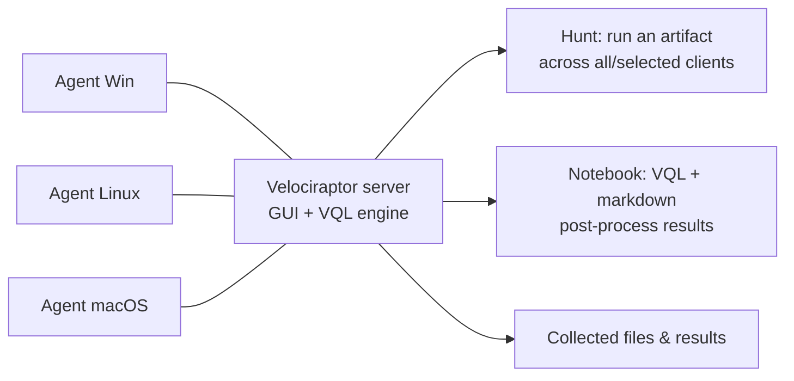

# Velociraptor

<div class="dfir-meta" markdown>
**Category:** Endpoint visibility, hunting & collection · **Platform:** Windows / Linux / macOS · **Last updated:** 2026-09-17
</div>

!!! abstract "What it does"
    Velociraptor is an open-source DFIR platform: a server plus lightweight agents that let you **query thousands of endpoints at once** in VQL (Velociraptor Query Language), collect artifacts, hunt for indicators, and pull files — live, across the fleet, in minutes. Where [KAPE](kape.md) triages one machine, Velociraptor asks a question of every machine. Also runs **offline** as a standalone collector with no server.

## How it's put together



- **Artifact** = a named, parameterised VQL query (e.g. `Windows.Forensics.Prefetch`) — the unit of collection/detection. Hundreds ship built in; you can write your own.
- **Hunt** = run an artifact across many clients and gather the results centrally.
- **Client collection** = run artifacts against one endpoint interactively.
- **Notebook** = VQL + markdown workspace to slice results (like a Jupyter for DFIR).
- **Offline collector** = a self-contained `.exe` you build in the GUI that runs a chosen set of artifacts on a machine with no server and drops a ZIP — great for air-gapped or one-off triage.

## Getting started (lab)

```powershell
# One binary is server, client and collector depending on args.
# Generate a server config, run the server (GUI on https://127.0.0.1:8889)
velociraptor.exe config generate > server.yaml
velociraptor.exe --config server.yaml frontend -v

# Build a client MSI/config from the GUI, deploy to endpoints (or run one client manually)
velociraptor.exe --config client.yaml client -v

# Standalone: query the local machine with no server at all
velociraptor.exe query "SELECT Name, Pid, Exe FROM pslist()"
velociraptor.exe artifacts collect Windows.Forensics.Prefetch --output pf.zip
```

## VQL in one screen

VQL looks like SQL but every data source is a **plugin function** (`pslist()`, `glob()`, `parse_evtx()`), and you pipe rows through `WHERE`/`SELECT`/`ORDER BY`. Column functions transform values.

```sql
-- Processes whose binary lives in a user-writable path
SELECT Pid, Name, Exe, CommandLine
FROM pslist()
WHERE Exe =~ "(?i)\\\\(Users|ProgramData|Windows\\\\Temp)\\\\"

-- Search every EVTX for a logon type 10 (RDP) from a given IP
SELECT *
FROM parse_evtx(filename="C:/Windows/System32/winevt/Logs/Security.evtx")
WHERE System.EventID.Value = 4624
  AND EventData.LogonType = 10
  AND EventData.IpAddress = "10.0.0.66"

-- Find files by glob, hash them
SELECT FullPath, Size, hash(path=FullPath).SHA256 AS SHA256
FROM glob(globs="C:/Users/*/AppData/Local/Temp/*.exe")
```

`=~` is regex match, `=` exact; functions like `hash()`, `parse_evtx()`, `parse_pe()`, `stat()`, `upload()` are the building blocks. The GUI has a VQL reference and autocompletes plugins.

## Artifacts worth knowing

| Artifact | Gives you |
|---|---|
| `Windows.KapeFiles.Targets` | Runs KAPE Targets logic natively — triage collection without KAPE |
| `Windows.Forensics.Prefetch` / `.Usn` / `.Timeline` | Parsed [Prefetch](../windows/prefetch.md), [USN journal](../windows/mft-usn.md), super-timeline |
| `Windows.Registry.*` (`AppCompatCache`, `RunMRU`, `Sysinternals.Eulacheck`, …) | [Registry artifacts](../windows/registry-keys.md) |
| `Windows.EventLogs.Evtx` / `.EvtxHunter` | Filter/hunt across EVTX; `.RDPAuth`, `.PowershellScriptblock` for common questions |
| `Windows.System.Pslist` / `.Services` / `.TaskScheduler` / `.Amcache` | Live system state + [persistence](../adversary/persistence.md) |
| `Windows.Forensics.SRUM` | [SRUM](../windows/srum.md) network/exec usage |
| `Windows.NTFS.MFT` / `.Recover` | Parse `$MFT`, recover deleted file content by entry id |
| `Windows.Detection.*`, `Generic.Detection.Yara.*` | YARA scanning of files/process memory across the fleet |
| `Windows.Sysinternals.Autoruns` | Full ASEP inventory |
| `Linux.*`, `MacOS.*` | Cross-platform equivalents (auth logs, cron, launchd, etc.) |
| `Server.Utils.CreateCollector` | Build the **offline collector** exe |

Browse everything under **View Artifacts** in the GUI; `Exchange` artifacts (community) add hundreds more.

## Typical workflows

**Fleet hunt for an IOC**

1. **Hunt → New Hunt**, pick an artifact (e.g. `Windows.Detection.Yara.Process` with your rule, or `Windows.Search.FileFinder` for a hash/path), scope to OS/labels, launch.
2. Watch results stream in from every client; download matching files centrally.
3. Post-process in a **Notebook** (`SELECT ClientId, FullPath FROM hunt_results(...) WHERE ...`).

**Remote triage of one host**

1. Search the client, **Collect Artifacts → `Windows.KapeFiles.Targets`** (SANS_Triage profile) or specific artifacts.
2. Download the collection; parse with [Zimmerman tools](zimmerman-tools.md) or built-in parsers.

**Offline / air-gapped**

1. Server GUI → build an **offline collector** exe with the artifacts you want.
2. Run it on the subject; it produces a ZIP; ingest that back into the server or parse directly.

## Gotchas

- The **same binary** is server, client, and collector — the mode is chosen by the sub-command/config; keep configs straight.
- Client deployment needs the server's CA/config baked into the client config or MSI — clients only trust that server.
- Hunts can be heavy; scope with **labels** and test on a few clients first. VQL that globs huge trees or hashes everything will hammer endpoints.
- Live-response reads volatile state; for a court-defensible image you still want a full [disk/memory image](imaging-collection.md).
- Results and uploaded files pile up on the server — mind disk and retention.
- Timestamps are UTC; VQL `timestamp()` helpers convert.

## References

- [Velociraptor documentation](https://docs.velociraptor.app/)
- [VQL reference](https://docs.velociraptor.app/vql_reference/) · [Artifact reference](https://docs.velociraptor.app/artifact_references/)
- [Velociraptor Exchange (community artifacts)](https://docs.velociraptor.app/exchange/)
- Pages: [KAPE](kape.md) · [Zimmerman tools](zimmerman-tools.md) · [Imaging & collection](imaging-collection.md)
