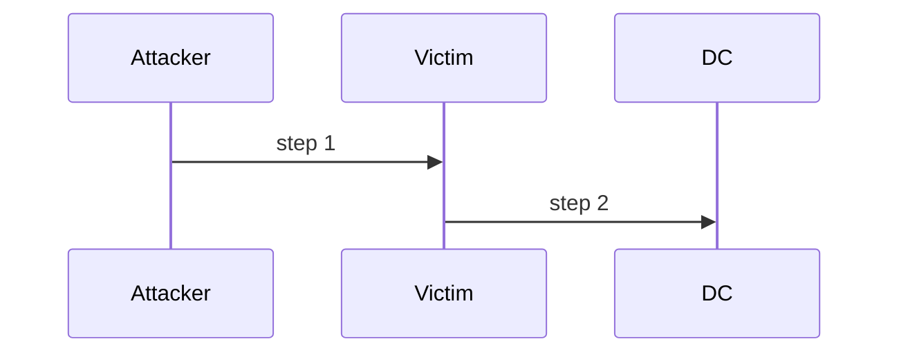

# {{TITLE}}

<div class="dfir-meta" markdown>
**MITRE ATT&CK:** Txxxx · **Tactic:** Execution / Persistence / … · **Last updated:** {{DATE}}
</div>

!!! abstract "Summary"
    What the attacker does and why.

## How the attack works

Step-by-step description. Add a diagram if useful:



## Attacker tooling / commands

```powershell
# example of what an attacker runs (for recognition, not replication)
```

## Artifacts left behind

| Where | Artifact | What to look for |
|---|---|---|
| Event log |  |  |
| Registry |  |  |
| File system |  |  |
| Network |  |  |

## Detection

=== "Splunk"

    ```spl
    index=wineventlog EventCode=4688
    | ...
    ```

=== "Sigma / other"

    ```yaml
    ```

## Response

What to contain, what to collect, what to check next.

## References

- [MITRE](https://attack.mitre.org/techniques/Txxxx/)
