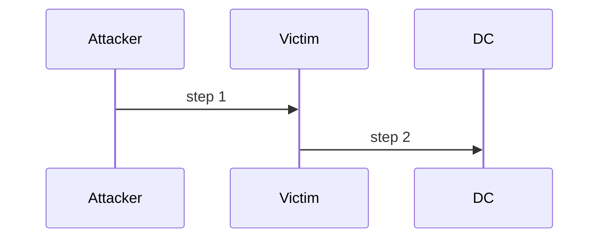

# {{TITLE}}

<div class="dfir-meta" markdown>
**MITRE ATT&CK:** Txxxx · **Tactic:** Execution / Persistence / … · **Last updated:** {{DATE}}
</div>

!!! abstract "Summary"
    What the attacker does and why.

## How the attack works

Step-by-step description. Add a diagram if useful:


```mermaid
sequenceDiagram
    Attacker->>Victim: step 1
    Victim->>DC: step 2
```

## Attacker tooling / commands

```powershell
# example of what an attacker runs (for recognition, not replication)
```

## Affected Windows versions

| Version | Exposure | Version-specific notes |
|---|---|---|
| **XP / Server 2003** |  |  |
| **Vista / 2008** |  |  |
| **7 / 2008 R2** |  |  |
| **8.1 / 2012 R2** |  |  |
| **10 / 2016 / 2019** |  |  |
| **11 / 2022 / 2025** |  |  |

## Artifacts left behind

| Where | Artifact | What to look for |
|---|---|---|
| Event log |  |  |
| Registry |  |  |
| File system |  |  |
| Network |  |  |

## Detection

=== "Splunk"

    ```spl
    index=wineventlog EventCode=4688
    | ...
    ```

=== "Sigma / other"

    ```yaml
    ```

## Response

What to contain, what to collect, what to check next.

### Remediation by Windows version

| Control | What it stops | Available on |
|---|---|---|
|  |  |  |

## References

- [MITRE](https://attack.mitre.org/techniques/Txxxx/)
- Pages: [Hardening by version](../adversary/hardening-by-version.md)
